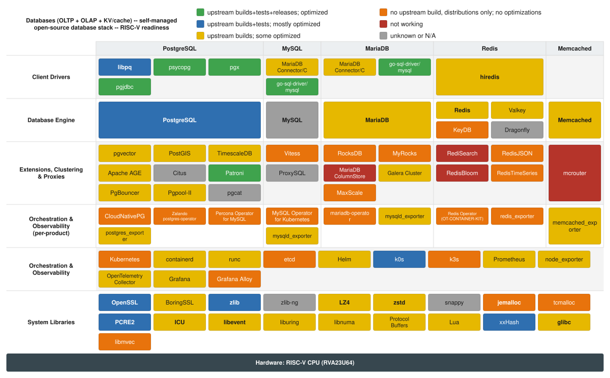

# Databases

**Author:** Ludovic Henry 
**Date:** 2026-08-27 
**Scope:** RISC-V readiness of the Databases (OLTP + OLAP + KV/cache), with focus on self-managed open-source database stack software stack 
**Target profile:** RVA23U64 
**Audience:** exec-product 
**Verification policy:** Colors are assigned from primary upstream sources, adversarially verified against the per-project reports under reports/. Items not verifiable against a second source are marked [NEEDS VERIFICATION]. 

 Link to full screen: [databases.svg](databases.svg)

## Scoping Assumptions

Five per-product sub-verticals are covered: PostgreSQL, MySQL, MariaDB, Redis, and Memcached.
Each has four per-product layers: Client Drivers, Database Engine, Extensions/Clustering & Proxies, and Orchestration & Observability (per-product).
Two shared layers span all five products: Orchestration & Observability (Kubernetes control plane, database operators, metrics pipeline) and System Libraries (compression, crypto, allocators, text, I/O, system runtime).
CPU-only per operator directive: no GPU/CUDA/ROCm paths.
Target profile RVA23U64: RVV 1.0, vector crypto (Zvkned), Zba/Zbb/Zbc, and FP16 are treated as mandatory baseline, so missing SIMD/crypto acceleration is a gap against baseline.

## Out of Scope

- **Managed cloud database services** (AWS RDS/Aurora/ElastiCache, GCP Cloud SQL/AlloyDB/MemoryStore, Azure Database): operator chose OSS-substrate-only; proprietary managed control planes are not native-RISC-V investment targets.
- **GPU/CUDA/ROCm acceleration paths** (GPU-accelerated analytics, GPU vector search): CPU-only scope per operator directive.
- **Windows and macOS server deployment**: Linux/riscv64 server focus.

---

## Artifact 1: Layered Stack Outline

### Layer 1.a -- PostgreSQL: Client Drivers

- **libpq** -- blue (critical)
  - C client library for PostgreSQL; bundled in-tree at src/interfaces/libpq; ships in every distro libpq5 riscv64 package.
  - License: PostgreSQL License. Governance: PostgreSQL Global Development Group.
  - Release provided by Debian, not upstream.

- **psycopg** -- green (optional)
  - PostgreSQL adapter for Python 3 (psycopg 3); publishes 10 riscv64 binary wheels for psycopg_binary on PyPI; pure-Python psycopg package is architecture-independent.
  - License: LGPL-3+. Governance: psycopg upstream (Daniele Varrazzo).

- **pgx** -- green (optional)
  - Pure-Go PostgreSQL driver and toolkit; no assembly, no CGo; architecture-independent Go module.
  - License: MIT. Governance: jackc (Jack Christensen).

- **pgjdbc** -- green (optional)
  - Pure-Java Type 4 JDBC driver; no native code; architecture-independent jar; inherits riscv64 from the JVM runtime.
  - License: BSD-2-Clause. Governance: pgjdbc organization.

**Pipeline chains and alternate paths**

- PostgreSQL vector search path: Application -> libpq/psycopg -> PostgreSQL -> pgvector -> SIMD distance kernels (RVV target; scalar fallback today)

### Layer 1.b -- MySQL: Client Drivers

- **MariaDB Connector/C** -- yellow (optional)
  - C client connector for MySQL; no riscv64 CI upstream; Ubuntu noble ships libmariadb3 for riscv64 via ports archive built from unpatched source.
  - License: LGPL-2.1. Governance: MariaDB Corporation.
  - Release provided by Ubuntu, not upstream.
  - Gap: No upstream riscv64 CI job; consumable only via distro package.

- **go-sql-driver/mysql** -- green (optional)
  - Pure-Go MySQL/MariaDB driver for database/sql; no CGo; architecture-independent Go module.
  - License: MPL-2.0. Governance: go-sql-driver upstream.

**Pipeline chains and alternate paths**

- Distributed MySQL (sharding) path: Application -> Vitess vtgate -> Vitess vttablet -> MySQL shard -> InnoDB

### Layer 1.c -- MariaDB: Client Drivers

- **MariaDB Connector/C** -- yellow (optional)
  - C client connector for MariaDB; no riscv64 CI upstream; Ubuntu noble ships libmariadb3 for riscv64 via ports archive built from unpatched source.
  - License: LGPL-2.1. Governance: MariaDB Corporation.
  - Release provided by Ubuntu, not upstream.
  - Gap: No upstream riscv64 CI job; consumable only via distro package.

- **go-sql-driver/mysql** -- green (optional)
  - Pure-Go MariaDB/MySQL driver for database/sql; no CGo; architecture-independent Go module.
  - License: MPL-2.0. Governance: go-sql-driver upstream.

**Pipeline chains and alternate paths**

- MySQL/MariaDB LSM storage path: MySQL/MariaDB -> MyRocks -> RocksDB -> LZ4/zstd/snappy compression -> glibc

### Layer 1.d -- Redis: Client Drivers

- **hiredis** -- yellow (critical)
  - C client / RESP protocol parser for Redis; bundled inside Redis itself; Debian sid ships libhiredis1.1.0 for riscv64 from unpatched upstream source.
  - License: BSD-3-Clause. Governance: Redis Ltd / Redis community.
  - Release provided by Debian, not upstream.
  - Gap: No riscv64 CI upstream; consumable only via distro package.

**Pipeline chains and alternate paths**

- KV cache on Kubernetes path: Redis Operator -> Redis/Valkey pod (container image) -> jemalloc -> glibc

### Layer 1.e -- Memcached: Client Drivers

N/A: No dedicated client driver nodes are defined in the scope for the Memcached product in the Client Drivers layer (Memcached clients are typically simple TCP; the scope defines only the engine, extensions, and observability layers for this product).

---

### Layer 2.a -- PostgreSQL: Database Engine

- **PostgreSQL** -- blue (critical)
  - Core RDBMS server with MVCC storage, WAL, streaming replication, TLS, and optional JIT (LLVM); 3 active riscv64 Build Farm workers run full regression suite on all supported branches.
  - License: PostgreSQL License. Governance: PostgreSQL Global Development Group.
  - Release provided by Debian, not upstream.

**Pipeline chains and alternate paths**

- PostgreSQL HA on Kubernetes path: CloudNativePG operator -> PostgreSQL pod (container image) -> streaming replication -> etcd/k8s API
- TLS/encrypted connection path: Engine -> OpenSSL -> AES-GCM (Zvkned/Zkn hardware; non-constant-time scalar fallback without them)

### Layer 2.b -- MySQL: Database Engine

- **MySQL** -- grey (critical)
  - Core MySQL RDBMS server with InnoDB, group replication, and TLS.
  - Data not available.
  - Gap: No riscv64 status data available; no upstream riscv64 CI or official binary known.

**Pipeline chains and alternate paths**

- Distributed MySQL (sharding) path: Application -> Vitess vtgate -> Vitess vttablet -> MySQL shard -> InnoDB
- CRC32C checksum path (vectorization gap): InnoDB/PostgreSQL/extstore -> CRC32C -> Zbc/Zbkc clmul hardware (patches open; scalar fallback today)

### Layer 2.c -- MariaDB: Database Engine

- **MariaDB** -- yellow (critical)
  - Core MariaDB server with InnoDB, Galera hooks, PCRE2 REGEXP, and TLS; Debian sid ships 1:11.8.8-1 built on native RISC-V hardware; InnoDB sv39 fix (MDEV-39142) merged 2026-03-25.
  - License: GPL-2.0. Governance: MariaDB Foundation.
  - Release provided by Debian, not upstream.
  - Gap: No upstream riscv64 CI; MDEV-29875 (RocksDB build failure) open but does not block core InnoDB server.

**Pipeline chains and alternate paths**

- MySQL/MariaDB LSM storage path: MySQL/MariaDB -> MyRocks -> RocksDB -> LZ4/zstd/snappy compression -> glibc

### Layer 2.d -- Redis: Database Engine

- **Redis** -- yellow (critical)
  - Core in-memory KV store with RESP protocol, persistence (RDB/AOF), bundled jemalloc/Lua, and optional TLS/modules; Debian sid ships redis 8.0.6-2 from unpatched upstream source on riscv64.
  - License: RSALv2/SSPLv1 (Redis 7.4+). Governance: Redis Ltd.
  - Release provided by Debian, not upstream.
  - Gap: No upstream riscv64 CI; PRs #15204 (Zbb popcount) and #15273 (HyperLogLog RVV) open and unmerged.

- **Valkey** -- yellow (optional)
  - Linux Foundation fork of Redis 7.2; drop-in Redis replacement; Debian sid ships valkey 9.1.1-1 with autopkgtest passing on riscv64 from unpatched source.
  - License: BSD-3-Clause. Governance: Linux Foundation / Valkey Technical Steering Committee.
  - Release provided by Debian, not upstream.
  - Gap: No upstream riscv64 CI.

- **KeyDB** -- orange (optional)
  - Multi-threaded Redis-compatible fork; no riscv64 CI, no riscv64 release binary, not packaged in any distro for riscv64; one anecdotal user build report (Issue #517, 2022).
  - License: BSD-3-Clause. Governance: Snapchat/KeyDB maintainers.
  - Gap: No riscv64 CI, no release artifact, no distro package; status unconfirmed.

- **Dragonfly** -- grey (optional)
  - Redis- and Memcached-API-compatible in-memory store with io_uring and SIMD usage.
  - Data not available.

**Pipeline chains and alternate paths**

- KV cache on Kubernetes path: Redis Operator -> Redis/Valkey pod (container image) -> jemalloc -> glibc

### Layer 2.e -- Memcached: Database Engine

- **Memcached** -- yellow (critical)
  - Core cache daemon with libevent event loop, optional TLS/SASL/seccomp, and extstore; Debian sid ships memcached 1.6.45-1 on riscv64 from unpatched source.
  - License: BSD-3-Clause. Governance: Memcached project (dormrad.io).
  - Release provided by Debian, not upstream.
  - Gap: No upstream riscv64 CI; Arch Linux RISC-V shows test suite FTBFS at this version, indicating riscv64 test reliability issues outside Debian's environment.

**Pipeline chains and alternate paths**

- CRC32C checksum path (vectorization gap): InnoDB/PostgreSQL/extstore -> CRC32C -> Zbc/Zbkc clmul hardware (patches open; scalar fallback today)

---

### Layer 3.a -- PostgreSQL: Extensions, Clustering & Proxies

- **pgvector** -- yellow (optional)
  - HNSW/IVFFlat ANN index extension for PostgreSQL; no riscv64 CI; Ubuntu 24.04 noble ships postgresql-16-pgvector (0.6.0-1) for riscv64 from unmodified upstream source; scalar path delivers full ANN functionality.
  - License: PostgreSQL License. Governance: pgvector upstream (Andrew Kane).
  - Release provided by Ubuntu, not upstream.
  - Gap: No riscv64 CI; SIMD-accelerated distance kernels (RVV) not implemented; scalar fallback is functional.

- **PostGIS** -- yellow (optional)
  - Geospatial extension for PostgreSQL; no riscv64 CI; Debian sid ships postgis 3.6.4+dfsg-2 for riscv64 with no riscv64-specific patches.
  - License: GPL-2.0+. Governance: PostGIS steering committee / OSGeo.
  - Release provided by Debian, not upstream.
  - Gap: No upstream riscv64 CI.

- **TimescaleDB** -- yellow (optional)
  - Time-series extension for PostgreSQL with hypertables, continuous aggregates, and columnar compression; Debian ships timescaledb 2.29.2+dfsg-1 on riscv64 from unpatched source.
  - License: Timescale License (TSL) / Apache-2.0 for open-source core. Governance: Timescale Inc.
  - Release provided by Debian, not upstream.
  - Gap: No upstream riscv64 CI.

- **Apache AGE** -- yellow (optional)
  - Graph database extension for PostgreSQL implementing openCypher; Debian packages postgresql-18-age for riscv64 from unmodified upstream source.
  - License: Apache-2.0. Governance: Apache Software Foundation.
  - Release provided by Debian, not upstream.
  - Gap: No upstream riscv64 CI; all GitHub Actions workflows run on x86_64 only.

- **Citus** -- grey (optional)
  - Distributed PostgreSQL (sharding) and columnar storage (OLAP) extension.
  - Data not available.

- **Patroni** -- green (optional)
  - PostgreSQL HA/automatic failover template (etcd/Consul/k8s DCS); pure Python; PyPI publishes patroni-4.1.5-py3-none-any.whl directly upstream; architecture-independent.
  - License: MIT. Governance: Zalando SE / patroni contributors.

- **PgBouncer** -- yellow (optional)
  - Lightweight PostgreSQL connection pooler; no riscv64 CI; Debian sid ships pgbouncer 1.25.2-1 from unpatched upstream source on riscv64.
  - License: ISC. Governance: pgbouncer contributors.
  - Release provided by Debian, not upstream.
  - Gap: No upstream riscv64 CI.

- **Pgpool-II** -- yellow (optional)
  - PostgreSQL connection pool, load balancing, and query routing; no upstream CI of any kind; Debian sid and Ubuntu 24.04 Noble both ship riscv64 binary packages from unpatched upstream source.
  - License: BSD. Governance: pgpool.net.
  - Release provided by Debian, not upstream.
  - Gap: No upstream CI at all; consumable only via distro package.

- **pgcat** -- grey (optional)
  - Rust PostgreSQL pooler/proxy with sharding and load balancing.
  - Data not available.

**Pipeline chains and alternate paths**

- PostgreSQL vector search path: Application -> libpq/psycopg -> PostgreSQL -> pgvector -> SIMD distance kernels (RVV target; scalar fallback today)

### Layer 3.b -- MySQL: Extensions, Clustering & Proxies

- **Vitess** -- orange (optional)
  - Horizontal sharding/distributed MySQL (vtgate, vttablet); no riscv64 CI across all 46 workflow files; v24.0.2 release publishes only amd64 artifacts; not packaged in any distro for riscv64.
  - License: Apache-2.0. Governance: CNCF graduated project.
  - Gap: No upstream riscv64 CI, no riscv64 release artifact, no distro package.

- **ProxySQL** -- grey (optional)
  - SQL-aware proxy/load balancer for MySQL/MariaDB.
  - Data not available.

**Pipeline chains and alternate paths**

- Distributed MySQL (sharding) path: Application -> Vitess vtgate -> Vitess vttablet -> MySQL shard -> InnoDB

### Layer 3.c -- MariaDB: Extensions, Clustering & Proxies

- **RocksDB** -- orange (optional)
  - LSM-tree key-value store underlining MyRocks; no riscv64 CI; Debian sid ships rocksdb 9.11.2-1 with riscv64-relevant patches (atomic builtin replacements, MIPS adaptation extensions); unmerged CMake riscv64 fix (PR #14530) stalled.
  - License: Apache-2.0/GPL-2.0. Governance: Meta/Facebook.
  - Release provided by Debian, not upstream.
  - Gap: Vanilla upstream source requires Debian-carried patches to build on riscv64; [PR #14530](https://github.com/facebook/rocksdb/pull/14530) (CMake riscv64 support) unmerged since 2025, last updated 2026-08-08 with no maintainer response.

- **MyRocks** -- orange (optional)
  - RocksDB-backed LSM storage engine for MySQL/MariaDB; facebook/mysql-5.6 archived 2026-03-01; MDEV-29875 (open critical, last updated 2026-06-02) documents that MariaDB's RocksDB plugin requires Debian-carried patches to build on riscv64.
  - License: GPL-2.0. Governance: Meta/Facebook (archived).
  - Release provided by Debian, not upstream.
  - Gap: Upstream repo archived; [MDEV-29875](https://jira.mariadb.org/browse/MDEV-29875) open critical since 2022; requires Debian patches; no upstream enablement path.

- **MariaDB ColumnStore** -- red (optional)
  - Distributed columnar analytics (OLAP) storage engine for MariaDB; three independent confirmed riscv64 blockers: (1) CMakeLists.txt silently skips the entire build when processor is not x86_64/amd64/aarch64; (2) mcs_int128.h falls through to x86 SSE movups inline asm, causing assembler error; (3) primproc.cpp hard-aborts with "Unsupported CPU architecture. ARM Advanced SIMD or x86_64 SSE4.2 required; aborting."
  - License: GPL-2.0. Governance: MariaDB Corporation.
  - Gap: Three compile-time and runtime hard blockers confirmed; no distro package; no upstream riscv64 issues or PRs.

- **Galera Cluster** -- yellow (optional)
  - Synchronous multi-master replication (wsrep) for MariaDB/MySQL/Percona XtraDB; Debian sid builds galera-4 26.4.27-1 successfully on riscv64 hardware (rv-manda-02) with no riscv64-specific patches.
  - License: GPL-2.0. Governance: Codership / MariaDB Foundation.
  - Release provided by Debian, not upstream.
  - Gap: No upstream riscv64 CI.

- **MaxScale** -- orange (optional)
  - MariaDB's SQL-aware proxy/query router (BSL-licensed); no upstream CI of any kind; not packaged for riscv64 in any distro; buildable from source with workarounds but no upstream validation.
  - License: Business Source License (BSL). Governance: MariaDB Corporation.
  - Gap: No CI, no riscv64 release, no distro package; BSL license limits redistribution.

**Pipeline chains and alternate paths**

- MySQL/MariaDB LSM storage path: MySQL/MariaDB -> MyRocks -> RocksDB -> LZ4/zstd/snappy compression -> glibc

### Layer 3.d -- Redis: Extensions, Clustering & Proxies

- **RediSearch** -- red (optional)
  - Search and vector-search module for Redis (part of Redis Stack); Redis Stack build path contains explicit `*) echo "Unsupported architecture"; exit 1` for any arch other than x86_64 and aarch64; no riscv64 CI across all 59 workflow files; Ubuntu 24.04 ships only the 7-year-old v1.2.2.
  - License: Redis Source Available License (RSAL). Governance: Redis Ltd.
  - Gap: Hard build blocker in redis/redis modules/Makefile; no riscv64 CI; no current distro package; no upstream-supported path exists.

- **RedisJSON** -- orange (optional)
  - JSON document type module for Redis (Rust); no riscv64 CI; bindgen 0.66.1 in current Cargo.lock resolves prior build blocker (Issue #830); no riscv64 binary released; not packaged in any distro for riscv64.
  - License: Redis Source Available License (RSAL). Governance: Redis Ltd.
  - Gap: No upstream riscv64 CI; no release artifact; not confirmed buildable but likely buildable from source.

- **RedisBloom** -- red (optional)
  - Probabilistic data structures module for Redis; Makefile contains explicit `$(error RedisBloom only supports 64-bit architectures (x64, arm64v8). Current architecture: $(ARCH))` hard error confirmed live against current master; no distro package for riscv64.
  - License: Redis Source Available License (RSAL). Governance: Redis Ltd.
  - Gap: Deliberate build-system hard error confirmed live; upstream explicitly states riscv64 unsupported; no workaround path.

- **RedisTimeSeries** -- orange (optional)
  - Time-series data type module for Redis; Makefile contains a hard `$(error)` blocking builds on architectures other than x64 and arm64v8 (confirmed live 2026-08-27); no riscv64 CI; no distro package.
  - License: Redis Source Available License (RSAL). Governance: Redis Ltd.
  - Gap: Build-time hard error confirmed in current master; no riscv64 CI; no distro package.

**Pipeline chains and alternate paths**

- KV cache on Kubernetes path: Redis Operator -> Redis/Valkey pod (container image) -> jemalloc -> glibc

### Layer 3.e -- Memcached: Extensions, Clustering & Proxies

- **mcrouter** -- red (optional)
  - Memcached protocol proxy/request router from Meta; mcrouter/lib/Clocks.cpp contains unconditional `#error Unsupported CPU` with no `__riscv` guard confirmed live; folly dependency has two open riscv64 build failures (#2493, #2416); no riscv64 CI; no distro packaging.
  - License: MIT. Governance: Meta/Facebook.
  - Gap: Compile-time hard error in Clocks.cpp confirmed live; folly dependency also broken on riscv64; no distro package; no upstream engagement.

**Pipeline chains and alternate paths**

- Observability path: Engine -> postgres_/mysqld_/redis_/memcached_exporter -> Prometheus -> Grafana -> (OpenTelemetry Collector/Grafana Alloy pipeline)

---

### Layer 4.a -- PostgreSQL: Orchestration & Observability (per-product)

- **CloudNativePG** -- orange (optional)
  - CNCF PostgreSQL Kubernetes operator; release-publish.yml hardcodes `platforms="linux/amd64,linux/arm64"` with no riscv64 entry; v1.30.0 contains no riscv64 binary or container image manifest; not packaged by any Linux distro (Kubernetes operators are distributed as container images only).
  - License: Apache-2.0. Governance: CNCF Sandbox (CloudNativePG contributors).
  - Gap: No riscv64 container image at any tier; no distro package; Kubernetes operator distribution model requires upstream container image.

- **Zalando postgres-operator** -- orange (optional)
  - Patroni-based PostgreSQL Kubernetes operator; publish_ghcr_image.yaml explicitly lists `platforms: linux/amd64,linux/arm64` only; v2.0.2 has zero release assets; not packaged in any distro.
  - License: MIT. Governance: Zalando SE.
  - Gap: No riscv64 container image; no release assets; no distro package.

- **Percona Operator for MySQL** -- orange (optional)
  - Kubernetes operator for Percona Server for MySQL/XtraDB Cluster; scan.yml CI builds only linux/amd64 and linux/arm64; no riscv64 container image published; not packaged in any distro.
  - License: Apache-2.0. Governance: Percona LLC.
  - Gap: No riscv64 CI or container image; gate is the Percona Server container image arch.

- **postgres_exporter** -- yellow (optional)
  - Prometheus exporter for PostgreSQL metrics; CI delegates cross-compilation to promci/build composite action with no test step on riscv64; upstream publishes `postgres_exporter-0.20.1.linux-riscv64.tar.gz` as a first-class release asset.
  - License: Apache-2.0. Governance: prometheus-community.
  - Gap: Build-only CI with no riscv64 test execution.

**Pipeline chains and alternate paths**

- PostgreSQL HA on Kubernetes path: CloudNativePG operator -> PostgreSQL pod (container image) -> streaming replication -> etcd/k8s API
- Observability path: Engine -> postgres_/mysqld_/redis_/memcached_exporter -> Prometheus -> Grafana -> (OpenTelemetry Collector/Grafana Alloy pipeline)

### Layer 4.b -- MySQL: Orchestration & Observability (per-product)

- **MySQL Operator for Kubernetes** -- orange (optional)
  - Oracle's official MySQL InnoDB Cluster Kubernetes operator; build.sh rejects riscv64 with `exit 1` via a `^(amd64|arm64)$` guard confirmed live; no distro packages; hard deployment blocker is absence of Oracle-published MySQL Shell riscv64 RPMs required inside the container image.
  - License: GPL-2.0. Governance: Oracle Corporation.
  - Gap: Hard build-script rejection of riscv64 confirmed live; Oracle MySQL Shell has no riscv64 RPMs.

- **mysqld_exporter** -- yellow (optional)
  - Prometheus exporter for MySQL/MariaDB metrics; upstream cross-compiles and ships `mysqld_exporter-0.20.0.linux-riscv64.tar.gz` via promu toolchain; all CI runs exclusively on x86_64 with no riscv64 test execution.
  - License: Apache-2.0. Governance: Prometheus community.
  - Gap: Build-only CI with no riscv64 test execution.

**Pipeline chains and alternate paths**

- Observability path: Engine -> postgres_/mysqld_/redis_/memcached_exporter -> Prometheus -> Grafana -> (OpenTelemetry Collector/Grafana Alloy pipeline)

### Layer 4.c -- MariaDB: Orchestration & Observability (per-product)

- **mariadb-operator** -- orange (optional)
  - Cloud-native Kubernetes operator for MariaDB; pure Go but release.yml and .goreleaser.yaml enumerate only amd64 and arm64; v26.6.0 contains only linux_amd64 and linux_arm64 tarballs; not packaged in any distro.
  - License: Apache-2.0. Governance: mariadb-operator contributors.
  - Gap: No riscv64 CI; no riscv64 release artifact; no distro package.

- **mysqld_exporter** -- yellow (optional)
  - Prometheus exporter for MySQL/MariaDB metrics; upstream cross-compiles and ships `mysqld_exporter-0.20.0.linux-riscv64.tar.gz` via promu toolchain; all CI runs exclusively on x86_64 with no riscv64 test execution.
  - License: Apache-2.0. Governance: Prometheus community.
  - Gap: Build-only CI with no riscv64 test execution.

**Pipeline chains and alternate paths**

- Observability path: Engine -> postgres_/mysqld_/redis_/memcached_exporter -> Prometheus -> Grafana -> (OpenTelemetry Collector/Grafana Alloy pipeline)

### Layer 4.d -- Redis: Orchestration & Observability (per-product)

- **Redis Operator (OT-CONTAINER-KIT)** -- orange (optional)
  - Kubernetes operator for Redis/Redis Cluster; publish-image.yaml hardcodes `platforms: linux/amd64,linux/arm64`; no distro packages for riscv64; no riscv64 support pathway.
  - License: Apache-2.0. Governance: OT-CONTAINER-KIT project.
  - Gap: No riscv64 container image; no distro package.

- **redis_exporter** -- orange (optional)
  - Prometheus exporter for Redis/Valkey metrics; pure Go but v1.90.0 ships 9 Linux binary tarballs covering s390x, ppc64le, arm64, arm, 386, mips64(le) but not riscv64; Makefile and Docker platform string also omit riscv64; not packaged in any distro.
  - License: MIT. Governance: oliver006 (Oliver Poitrey).
  - Gap: riscv64 explicitly absent from build matrix despite covering many other architectures.

- **memcached_exporter** -- yellow (optional)
  - Prometheus exporter for Memcached metrics; CI cross-compiles for riscv64 via promu crossbuild with no test execution on riscv64; upstream ships `memcached_exporter-0.17.0.linux-riscv64.tar.gz` as a first-class release asset.
  - License: Apache-2.0. Governance: Prometheus community.
  - Gap: Build-only CI with no riscv64 test execution.

**Pipeline chains and alternate paths**

- Observability path: Engine -> postgres_/mysqld_/redis_/memcached_exporter -> Prometheus -> Grafana -> (OpenTelemetry Collector/Grafana Alloy pipeline)

### Layer 4.e -- Memcached: Orchestration & Observability (per-product)

N/A: No dedicated per-product Orchestration & Observability nodes are defined in the scope for Memcached beyond memcached_exporter (which appears under Redis Orchestration & Observability given its Prometheus community ownership; see Layer 4.d for memcached_exporter).

---

### Layer 5 -- Orchestration & Observability (Shared)

- **Kubernetes** -- orange (optional)
  - Container orchestration control plane + kubelet; hack/lib/golang.sh enumerates only linux/amd64, linux/arm64, linux/s390x, linux/ppc64le in all supported platform arrays; PR #141291 (open 2026-08-10) proposes adding riscv64 only to the pause image and does not change supported platform arrays; Debian ships a patched kubectl-only build with no server-side components.
  - License: Apache-2.0. Governance: CNCF graduated (Kubernetes SIG Network/Arch).
  - Gap: riscv64 absent from all upstream supported platform arrays; no official release binaries or server images; Debian package is kubectl-only with patches.

- **containerd** -- yellow (optional)
  - Container runtime (CRI) for Kubernetes; nightly CI cross-compiles riscv64 from x86_64 host with no test step; upstream ships riscv64 release binaries on every tagged release (v2.3.4 confirmed); [PR #13124](https://github.com/containerd/containerd/pull/13124) for RISE-runner integration tests remains open.
  - License: Apache-2.0. Governance: CNCF graduated.
  - Gap: Build-only CI with no riscv64 test execution; PR #13124 for upstream test coverage unmerged.

- **runc** -- yellow (optional)
  - OCI low-level container runtime; upstream cross-compiles and ships `runc.riscv64` in every release (v1.5.1 confirmed); all four CI workflow files contain zero riscv64 jobs; Issue #5166 requesting riscv64 CI closed without resolution.
  - License: Apache-2.0. Governance: OCI / CNCF.
  - Gap: Build-only CI with no riscv64 test execution; CI request Issue #5166 closed without resolution.

- **etcd** -- orange (optional)
  - Distributed KV store; k8s control-plane datastore and DCS for Patroni; no upstream riscv64 CI or release binaries (v3.7.1/v3.6.14/v3.5.33 all have 8 assets with no riscv64); Debian ships riscv64 package but requires at least two riscv64-specific patches: 0002 removes os.Exit(1) startup gate and 0025 reduces InitialMmapSize from 10 GB to 16 MB specifically for riscv64.
  - License: Apache-2.0. Governance: CNCF graduated.
  - Release provided by Debian, not upstream.
  - Gap: Upstream has startup gate that explicitly blocks riscv64 without the `ETCD_UNSUPPORTED_ARCH` environment variable; requires two Debian-carried riscv64-specific patches to function; no official upstream release.

- **Helm** -- yellow (optional)
  - Kubernetes package manager; upstream releases `helm-v4.2.4-linux-riscv64.tar.gz` on get.helm.sh; CI cross-compiles via goreleaser (goriscv64: rva20u64) with host-native x86_64 test run only, no riscv64 test execution.
  - License: Apache-2.0. Governance: CNCF graduated.
  - Gap: Build-only CI with no riscv64 test execution; goreleaser uses rva20u64 profile, not rva23u64 baseline target.

- **k0s** -- blue (optional)
  - Zero-friction Kubernetes distribution; .github/workflows/riscv64.yml contains both `unittests-k0s` job and a `smoketests` matrix running natively on `ubuntu-24.04-riscv` RISE runners; latest release v1.36.3+k0s.2 contains no riscv64 binary asset.
  - License: Apache-2.0. Governance: k0sproject / Mirantis.
  - Gap: No upstream riscv64 release binary despite full CI; riscv64 binary must be built from source.

- **k3s** -- orange (optional)
  - Lightweight Kubernetes distribution; v1.36.4+k3s1 contains only amd64, arm64, and armhf assets; install script calls `fatal "Unsupported architecture $ARCH"` on riscv64; [PR #7778](https://github.com/k3s-io/k3s/pull/7778) (primary enablement PR) closed without merging; draft CI [PR #13854](https://github.com/k3s-io/k3s/pull/13854) open with zero reviews.
  - License: Apache-2.0. Governance: CNCF graduated (k3s-io).
  - Gap: Primary riscv64 enablement PR #7778 closed without merging; install script hard-rejects riscv64.

- **Prometheus** -- yellow (optional)
  - Metrics time-series database and scraper; upstream ships `prometheus-X.Y.Z.linux-riscv64.tar.gz` and Docker images (since v3.10.0) in every release; all test jobs run on x86_64 only with no riscv64 test execution.
  - License: Apache-2.0. Governance: CNCF graduated.
  - Gap: Build-only CI with no riscv64 test execution.

- **node_exporter** -- yellow (optional)
  - Host/hardware metrics exporter for Prometheus; upstream ships `node_exporter-1.12.1.linux-riscv64.tar.gz` and riscv64 Docker images; all CI tests run on x86_64; [Issues #2296](https://github.com/prometheus/node_exporter/issues/2296) and [#3180](https://github.com/prometheus/node_exporter/issues/3180) document that riscv64 e2e tests fail due to x86-specific CPU fixture data.
  - License: Apache-2.0. Governance: Prometheus community.
  - Gap: Build-only CI; known e2e test failures on riscv64 documented in open issues.

- **OpenTelemetry Collector** -- yellow (optional)
  - Vendor-neutral telemetry (metrics/traces/logs) pipeline; build-and-test.yml cross-compiles for riscv64 with no test step; upstream publishes riscv64 deb, rpm, and tar.gz binaries (v0.159.0 confirmed).
  - License: Apache-2.0. Governance: CNCF incubating.
  - Gap: Build-only CI with no riscv64 test execution.

- **Grafana** -- yellow (optional)
  - Observability dashboards/visualization; release-build.yml includes 5 riscv64 jobs all marked `continue-on-error: true` with build-only steps; v13.2.0 has zero riscv64 release assets; Alpine edge/community ships grafana 12.4.4-r1 as the only consumable riscv64 package.
  - License: AGPL-3.0. Governance: Grafana Labs.
  - Release provided by Alpine Linux, not upstream.
  - Gap: riscv64 CI jobs marked `continue-on-error` indicating non-blocking; no upstream riscv64 release binary; community Alpine package only.

- **Grafana Alloy** -- orange (optional)
  - OpenTelemetry-based telemetry collector/agent; build.yml matrix is `[amd64, arm64, ppc64le, s390x]` with riscv64 absent; v1.19.2 contains zero riscv64 assets; [Issue #1036](https://github.com/grafana/alloy/issues/1036) closed as `not_planned`; not packaged in any distro.
  - License: Apache-2.0. Governance: Grafana Labs.
  - Gap: riscv64 explicitly absent from build matrix; Issue #1036 closed not_planned; no distro package.

**Pipeline chains and alternate paths**

- PostgreSQL HA on Kubernetes path: CloudNativePG operator -> PostgreSQL pod (container image) -> streaming replication -> etcd/k8s API
- KV cache on Kubernetes path: Redis Operator -> Redis/Valkey pod (container image) -> jemalloc -> glibc
- Observability path: Engine -> postgres_/mysqld_/redis_/memcached_exporter -> Prometheus -> Grafana -> (OpenTelemetry Collector/Grafana Alloy pipeline)

---

### Layer 6 -- System Libraries (Shared)

- **OpenSSL** -- blue (critical)
  - TLS and crypto library for every engine's encrypted connections; cross-compiles.yml runs full QEMU test suite on riscv64 on every push (EXTENDED=true) and EVP tests on every PR.
  - License: Apache-2.0. Governance: OpenSSL Software Foundation.
  - Release provided by Debian, not upstream.

- **BoringSSL** -- yellow (optional)
  - Google's TLS library; LUCI CQ-gated builders `android_riscv64_compile_only` and `android_riscv64_prefixed_compile` are mandatory but both have `run_ssl_tests:false` and `run_unit_tests:false`; source-only with no binary releases.
  - License: ISC/OpenSSL-variant. Governance: Google.
  - Gap: CQ-gated build-only CI; no test execution; no binary releases from any source.

- **zlib** -- blue (critical)
  - DEFLATE compression; others.yml runs full cmake build AND ctest test suite under QEMU on riscv64; source-only upstream; distro packages available.
  - License: Zlib. Governance: Jean-loup Gailly / Mark Adler.
  - Release provided by Ubuntu, not upstream.

- **zlib-ng** -- grey (optional)
  - SIMD-optimized zlib replacement.
  - Data not available.

- **LZ4** -- yellow (critical)
  - Fast compression library; CI runs full test suite via QEMU on riscv64 (blue-grade CI); however LZ4_FAST_DEC_LOOP is explicitly disabled on riscv64 while enabled on x86 and aarch64; only scalar Zicclsm unaligned-access optimization merged (PR #1648); optimization modifier caps grade from blue to yellow.
  - License: BSD-2-Clause. Governance: Yann Collet / lz4 project.
  - Release provided by Debian, not upstream.
  - Gap: LZ4_FAST_DEC_LOOP disabled on riscv64 in lib/lz4.c lines 479-485; five RVV/optimization PRs (#1678, #1686, #1734, #1738, #1739) all open and unmerged as of 2026-08-27.

- **zstd** -- yellow (critical)
  - High-ratio compression library; CI runs full test suite under QEMU (rv64gc + RVV vlen=128/256/512); optimization modifier caps to yellow: unaligned memory access (+74% on Zicclsm hardware, [PR #4596](https://github.com/facebook/zstd/pull/4596)), sequence decode fast path ([PR #4557](https://github.com/facebook/zstd/pull/4557)), and Huffman 4-way decompression ([PR #4622](https://github.com/facebook/zstd/pull/4622)) all open and unmerged.
  - License: BSD/GPL-2.0 dual. Governance: Meta/Facebook.
  - Release provided by Ubuntu, not upstream.
  - Gap: Three highest-impact RVV optimization PRs (#4557, #4596, #4622) all open and unmerged.

- **snappy** -- grey (optional)
  - Fast compression used by RocksDB/MyRocks.
  - Data not available.

- **jemalloc** -- orange (critical)
  - Default bundled allocator for Redis; Debian sid ships libjemalloc2 5.3.1-2 for riscv64 from unpatched source (clean-distro-build yellow floor); jemalloc is an optimization-purpose allocator and riscv64 falls to the wildcard case with HAVE_CPU_SPINWAIT=0 -- no Zihintpause pause instruction, no RVV intrinsics, no RISC-V assembly; optimization-absent modifier caps grade from yellow to orange.
  - License: BSD-2-Clause. Governance: jemalloc contributors.
  - Release provided by Debian, not upstream.
  - Gap: No RISC-V assembly or SIMD; HAVE_CPU_SPINWAIT=0 means spin-wait hardware hint absent; performance impact is significant for Redis workloads.

- **tcmalloc** -- orange (optional)
  - Google's per-CPU RSEQ slab allocator; no riscv64 CI; percpu.h guards `TCMALLOC_PERCPU_RSEQ_SUPPORTED_PLATFORM` to x86_64 and aarch64 only; riscv64 gets RSEQ signature 0x0 (invalid sentinel) and falls back to slower per-thread cache path.
  - License: Apache-2.0. Governance: Google.
  - Gap: Per-CPU RSEQ slab entirely absent on riscv64; falls to slower per-thread cache path.

- **PCRE2** -- blue (critical)
  - Regex engine for MariaDB REGEXP (JIT via SLJIT); dev.yml runs full ctest suite inside a QEMU riscv64 container on every push to main/release branches; SLJIT has sljitNativeRISCV_64.c.
  - License: BSD-3-Clause. Governance: PCRE2 Project.
  - Release provided by Debian, not upstream.

- **ICU** -- yellow (critical)
  - Unicode collation/locale for PostgreSQL and MySQL; no upstream riscv64 CI; Debian sid ships ICU 78.3-2 built on native riscv64 hardware (rv-manda-02) with no riscv64-specific patches; pure C/C++ with no SIMD.
  - License: ICU License (Unicode). Governance: Unicode Consortium.
  - Release provided by Debian, not upstream.
  - Gap: No upstream riscv64 CI.

- **libevent** -- yellow (critical)
  - Event loop mandatory for Memcached and used by MySQL Router/PgBouncer; no riscv64 CI; Debian sid ships libevent 2.1.13-stable-1 built on riscv64 hardware (rv-manda-04) with no riscv64-specific patches.
  - License: BSD-3-Clause. Governance: libevent contributors.
  - Release provided by Debian, not upstream.
  - Gap: No upstream riscv64 CI.

- **liburing** -- yellow (optional)
  - io_uring async I/O; CI contains riscv64 matrix entry that cross-compiles and compiles a test binary but never executes it; source-only upstream; Debian sid and Arch RISC-V ship riscv64 packages from unpatched source.
  - License: MIT/LGPL-2.1. Governance: Jens Axboe.
  - Gap: Build-only CI that compiles but does not run tests; no binary releases.

- **libnuma** -- yellow (optional)
  - NUMA-aware memory library for InnoDB interleave allocation; no riscv64 CI; Debian sid ships libnuma1 2.0.19-1+b2 on rv-osuosl-03 from completely unpatched source (empty patch series).
  - License: LGPL-2.1. Governance: numactl contributors.
  - Release provided by Debian, not upstream.
  - Gap: No upstream riscv64 CI.

- **Protocol Buffers** -- yellow (optional)
  - MySQL group replication wire protocol, X Protocol, and NDB Cluster; no riscv64 CI across 26 upstream workflow files; Debian sid ships protobuf 3.21.12-16 with no riscv64-specific patches.
  - License: BSD-3-Clause. Governance: Google.
  - Release provided by Debian, not upstream.
  - Gap: No upstream riscv64 CI.

- **Lua** -- yellow (optional)
  - Scripting runtime for Redis EVAL (Lua 5.1 bundled) and memcached proxy (Lua 5.4 vendored); pure ISO C99 with no architecture-specific code; Ubuntu 24.04 and Debian sid ship lua5.4 5.4.8-2 with no riscv64-specific patches.
  - License: MIT. Governance: PUC-Rio.
  - Release provided by Ubuntu, not upstream.
  - Gap: No upstream CI of any kind; consumable via distro package.

- **xxHash** -- blue (optional)
  - Non-cryptographic hashing used by Redis, memcached proxy routing, and RocksDB; CI qemu-consistency job runs full test suite on riscv64 under qemu-riscv64-static for both scalar and RVV (vlen 128/256/512); RVV backend covers all four primary XXH3 hot paths.
  - License: BSD-2-Clause. Governance: Yann Collet (Cyan4973).

- **glibc** -- yellow (critical)
  - C runtime, libm, pthreads, libatomic; required by every engine; two riscv64 Buildbot builders (293, 336) are offline (last build June 2025); tests are executed on riscv64 native hardware (bpi-f3-2) but fail; Debian, Ubuntu, and Arch ship glibc 2.44 for riscv64 from unpatched upstream source.
  - License: LGPL-2.1+/GPL-2.0+. Governance: GNU project / FSF.
  - Gap: Both upstream riscv64 Buildbot builders offline; test suite fails on native hardware; CI coverage of riscv64 currently absent.

- **libmvec** -- orange (optional)
  - Vector math functions (part of glibc); libmvec does not exist for riscv64 in upstream glibc; sysdeps/riscv/configure.ac never sets `build_mathvec=yes`; no distro ships libmvec for riscv64; no libc-alpha submissions through August 2026.
  - License: LGPL-2.1+/GPL-2.0+. Governance: GNU project / FSF.
  - Gap: libmvec not built or shipped for riscv64 in any released glibc version; no upstream work in progress as of 2026-08-27.

---

### Pipeline Chains and Alternate Paths (Full List)

- PostgreSQL vector search path: Application -> libpq/psycopg -> PostgreSQL -> pgvector -> SIMD distance kernels (RVV target; scalar fallback today)
- MySQL/MariaDB LSM storage path: MySQL/MariaDB -> MyRocks -> RocksDB -> LZ4/zstd/snappy compression -> glibc
- Distributed MySQL (sharding) path: Application -> Vitess vtgate -> Vitess vttablet -> MySQL shard -> InnoDB
- PostgreSQL HA on Kubernetes path: CloudNativePG operator -> PostgreSQL pod (container image) -> streaming replication -> etcd/k8s API
- TLS/encrypted connection path: Engine -> OpenSSL -> AES-GCM (Zvkned/Zkn hardware; non-constant-time scalar fallback without them)
- Compression path (vectorization gap): Engine/RocksDB -> zstd/LZ4/zlib -> RVV vectorized decode (NOT enabled today -> scalar)
- CRC32C checksum path (vectorization gap): InnoDB/PostgreSQL/extstore -> CRC32C -> Zbc/Zbkc clmul hardware (patches open; scalar fallback today)
- KV cache on Kubernetes path: Redis Operator -> Redis/Valkey pod (container image) -> jemalloc -> glibc
- Observability path: Engine -> postgres_/mysqld_/redis_/memcached_exporter -> Prometheus -> Grafana -> (OpenTelemetry Collector/Grafana Alloy pipeline)

---

## Artifact 2: Status Table

### (a) Full Table

| Node | Layer | Criticality | Color | Release provider | Justification summary | Primary source | As-of | Delta-vs-report |
|------|-------|-------------|-------|------------------|-----------------------|----------------|-------|-----------------|
| libpq | PostgreSQL -- Client Drivers | critical | blue | Debian | Build Farm has 3 active riscv64 workers running full regression suite; riscv64 packages in Debian/Ubuntu/Arch | [Build Farm](https://buildfarm.postgresql.org/cgi-bin/show_members.pl?os=Linux&arch=riscv64) | 2026-06-17 | Report stated 4 workers; live check 2026-08-27 confirms 3 (mollusk dropped off); color unchanged |
| psycopg | PostgreSQL -- Client Drivers | optional | green | upstream | riscv64 in full build+test matrix (QEMU); 10 riscv64 binary wheels on PyPI for psycopg_binary 3.3.4 | [packages-bin.yml](https://github.com/psycopg/psycopg/blob/master/.github/workflows/packages-bin.yml) | 2026-08-14 | none |
| pgx | PostgreSQL -- Client Drivers | optional | green | upstream | Pure-Go; Step 0 applies; no compiled artifacts; architecture-independent Go module | [ci.yml](https://github.com/jackc/pgx/blob/master/.github/workflows/ci.yml) | 2026-06-17 | none |
| pgjdbc | PostgreSQL -- Client Drivers | optional | green | upstream | Pure-Java noarch jar; Step 0 applies; no native code; riscv64 inherited from JVM | [REL42.7.13](https://github.com/pgjdbc/pgjdbc/releases/tag/REL42.7.13) | 2026-07-06 | none |
| PostgreSQL | PostgreSQL -- Database Engine | critical | blue | Debian | 3 active riscv64 Build Farm workers; full regression and tap test suite on all supported branches; JIT disabled on riscv64 (performance gap, not correctness) | [Build Farm](https://buildfarm.postgresql.org/cgi-bin/show_members.pl?os=Linux&arch=riscv64) | 2026-08-27 | Report listed 4 workers; live check 2026-08-27 shows 3 active; color unchanged |
| pgvector | PostgreSQL -- Extensions, Clustering & Proxies | optional | yellow | Ubuntu | No riscv64 CI; Ubuntu 24.04 noble ships postgresql-16-pgvector (0.6.0-1) from unmodified upstream source; scalar path delivers full ANN functionality | [build.yml](https://github.com/pgvector/pgvector/blob/master/.github/workflows/build.yml) | 2026-06-17 | Proposed orange/optimization-absent refuted; corrected to yellow/clean-distro-build |
| PostGIS | PostgreSQL -- Extensions, Clustering & Proxies | optional | yellow | Debian | No riscv64 CI; Debian sid ships postgis 3.6.4+dfsg-2 with no riscv64-specific patches | [portability.yml](https://github.com/postgis/postgis/blob/master/.woodpecker/portability.yml) | 2026-06-17 | none |
| TimescaleDB | PostgreSQL -- Extensions, Clustering & Proxies | optional | yellow | Debian | No upstream riscv64 CI; Debian sid ships timescaledb 2.29.2+dfsg-1 from unpatched source; only Debian patch is architecture-neutral no-git-hook | [Debian buildd](https://buildd.debian.org/status/package.php?p=timescaledb&suite=sid) | 2026-08-27 | Proposed orange incorrect; Debian package builds riscv64 from unpatched source; corrected to yellow |
| Apache AGE | PostgreSQL -- Extensions, Clustering & Proxies | optional | yellow | Debian | All 5 upstream workflows run on x86_64 only; Debian packages postgresql-18-age for riscv64 from unmodified source with zero architecture-specific patches | [installcheck.yaml](https://github.com/apache/age/blob/master/.github/workflows/installcheck.yaml) | 2026-06-17 | none |
| Citus | PostgreSQL -- Extensions, Clustering & Proxies | optional | grey | none | Data not available | | 2026-08-27 | n/a |
| Patroni | PostgreSQL -- Extensions, Clustering & Proxies | optional | green | upstream | Pure Python; PyPI publishes py3-none-any wheel directly; Step 0 applies; architecture-independent | [PyPI](https://pypi.org/pypi/patroni/json) | 2026-06-17 | none |
| PgBouncer | PostgreSQL -- Extensions, Clustering & Proxies | optional | yellow | Debian | No riscv64 CI; Debian sid ships pgbouncer 1.25.2-1 from unpatched upstream source on riscv64 | [pgbouncer-ci.yml](https://github.com/pgbouncer/pgbouncer/blob/main/.github/workflows/pgbouncer-ci.yml) | 2026-08-14 | none |
| Pgpool-II | PostgreSQL -- Extensions, Clustering & Proxies | optional | yellow | Debian | No upstream CI at all; Debian sid and Ubuntu 24.04 Noble ship riscv64 packages from unpatched upstream source | [packages.ubuntu.com](https://packages.ubuntu.com/noble/pgpool2) | 2026-08-14 | none |
| pgcat | PostgreSQL -- Extensions, Clustering & Proxies | optional | grey | none | Data not available | | 2026-08-27 | n/a |
| CloudNativePG | PostgreSQL -- Orchestration & Observability (per-product) | optional | orange | none | release-publish.yml hardcodes linux/amd64,linux/arm64 only; v1.30.0 has no riscv64 binary or container image; no distro package | [release-publish.yml](https://github.com/cloudnative-pg/cloudnative-pg/blob/main/.github/workflows/release-publish.yml) | 2026-06-17 | color unchanged; color_case corrected from downstream-only to empty (no distro package exists) |
| Zalando postgres-operator | PostgreSQL -- Orchestration & Observability (per-product) | optional | orange | none | publish_ghcr_image.yaml lists only linux/amd64,linux/arm64; v2.0.2 has zero release assets; no distro package | [publish_ghcr_image.yaml](https://github.com/zalando/postgres-operator/blob/master/.github/workflows/publish_ghcr_image.yaml) | 2026-08-27 | n/a |
| Percona Operator for MySQL | PostgreSQL -- Orchestration & Observability (per-product) | optional | orange | none | scan.yml builds only linux/amd64 and linux/arm64; no riscv64 container image; no distro package | [scan.yml](https://github.com/percona/percona-server-mysql-operator/blob/main/.github/workflows/scan.yml) | 2026-08-27 | n/a |
| postgres_exporter | PostgreSQL -- Orchestration & Observability (per-product) | optional | yellow | upstream | CI delegates to promci/build (cross-compilation, no test step); upstream publishes postgres_exporter-0.20.1.linux-riscv64.tar.gz | [ci.yml](https://github.com/prometheus-community/postgres_exporter/blob/main/.github/workflows/ci.yml) | 2026-08-14 | none |
| MariaDB Connector/C | MySQL -- Client Drivers | optional | yellow | Ubuntu | No riscv64 CI; Ubuntu noble ships libmariadb3 for riscv64 from unpatched source; PR #295 merged upstream 2026-02-09 | [ci.yml](https://github.com/mariadb-corporation/mariadb-connector-c/blob/3.4/.github/workflows/ci.yml) | 2026-06-17 | none |
| go-sql-driver/mysql | MySQL -- Client Drivers | optional | green | upstream | Pure-Go; Step 0 applies; architecture-independent Go module | [test.yml](https://github.com/go-sql-driver/mysql/blob/master/.github/workflows/test.yml) | 2026-06-17 | none |
| MySQL | MySQL -- Database Engine | critical | grey | none | Data not available | | 2026-08-27 | n/a |
| Vitess | MySQL -- Extensions, Clustering & Proxies | optional | orange | none | Zero riscv64 references across all 46 workflow files; v24.0.2 publishes only amd64 artifacts; no distro package | [workflows](https://github.com/vitessio/vitess/tree/main/.github/workflows) | 2026-08-27 | n/a |
| ProxySQL | MySQL -- Extensions, Clustering & Proxies | optional | grey | none | Data not available | | 2026-08-27 | n/a |
| MySQL Operator for Kubernetes | MySQL -- Orchestration & Observability (per-product) | optional | orange | none | build.sh rejects riscv64 with exit 1; no distro packages; hard blocker is absence of Oracle MySQL Shell riscv64 RPMs | [build.sh](https://github.com/mysql/mysql-operator/blob/trunk/build.sh) | 2026-06-17 | none |
| mysqld_exporter | MySQL -- Orchestration & Observability (per-product) | optional | yellow | upstream | Upstream ships mysqld_exporter-0.20.0.linux-riscv64.tar.gz; all CI runs on x86_64 with no riscv64 test execution | [ci.yml](https://github.com/prometheus/mysqld_exporter/blob/main/.github/workflows/ci.yml) | 2026-06-17 | none |
| MariaDB Connector/C | MariaDB -- Client Drivers | optional | yellow | Ubuntu | No riscv64 CI; Ubuntu noble ships libmariadb3 for riscv64 from unpatched source; PR #295 merged upstream 2026-02-09 | [ci.yml](https://github.com/mariadb-corporation/mariadb-connector-c/blob/3.4/.github/workflows/ci.yml) | 2026-06-17 | none |
| go-sql-driver/mysql | MariaDB -- Client Drivers | optional | green | upstream | Pure-Go; Step 0 applies; architecture-independent Go module | [test.yml](https://github.com/go-sql-driver/mysql/blob/master/.github/workflows/test.yml) | 2026-06-17 | none |
| MariaDB | MariaDB -- Database Engine | critical | yellow | Debian | Zero upstream riscv64 CI; Debian sid ships 1:11.8.8-1 built on rv-osuosl-03; no riscv64-specific patches; InnoDB sv39 fix merged 2026-03-25; MDEV-29875 (RocksDB) open but does not block core server | [Debian buildd](https://buildd.debian.org/status/package.php?p=mariadb&suite=sid) | 2026-06-17 | none |
| RocksDB | MariaDB -- Extensions, Clustering & Proxies | optional | orange | Debian | No riscv64 CI; Debian ships 9.11.2-1 but with riscv64-relevant patches; PR #14530 (CMake riscv64 support) stalled | [Debian patch](https://sources.debian.org/src/rocksdb/9.11.2-1/debian/patches/0001-replace-old-sync-with-new-atomic-builtin-equivalents.patch/) | 2026-08-27 | Patch numbering corrected; substance unchanged; color unchanged |
| MyRocks | MariaDB -- Extensions, Clustering & Proxies | optional | orange | Debian | facebook/mysql-5.6 archived 2026-03-01; MDEV-29875 open critical; requires Debian-carried patches to build on riscv64 | [MDEV-29875](https://jira.mariadb.org/browse/MDEV-29875) | 2026-08-14 | none |
| MariaDB ColumnStore | MariaDB -- Extensions, Clustering & Proxies | optional | red | none | Three confirmed compile-time and runtime hard blockers: CMakeLists.txt build skip, SSE movups asm error in mcs_int128.h, hard abort in primproc.cpp | [primproc.cpp](https://github.com/mariadb-corporation/mariadb-columnstore-engine/blob/develop/primitives/primproc/primproc.cpp) | 2026-06-17 | none |
| Galera Cluster | MariaDB -- Extensions, Clustering & Proxies | optional | yellow | Debian | No upstream riscv64 CI; Debian sid builds galera-4 26.4.27-1 on rv-manda-02 with no riscv64-specific patches | [Debian buildd](https://buildd.debian.org/status/logs.php?pkg=galera-4&arch=riscv64) | 2026-08-14 | none |
| MaxScale | MariaDB -- Extensions, Clustering & Proxies | optional | orange | none | No upstream CI at all; not packaged for riscv64 in any distro; BSL license | [MaxScale .github](https://api.github.com/repos/mariadb-corporation/MaxScale/contents/.github) | 2026-08-14 | none |
| mariadb-operator | MariaDB -- Orchestration & Observability (per-product) | optional | orange | none | release.yml and .goreleaser.yaml enumerate only amd64 and arm64; v26.6.0 has only linux_amd64 and linux_arm64 tarballs; no distro package | [v26.6.0](https://github.com/mariadb-operator/mariadb-operator/releases/tag/26.6.0) | 2026-06-17 | none |
| mysqld_exporter | MariaDB -- Orchestration & Observability (per-product) | optional | yellow | upstream | Upstream ships mysqld_exporter-0.20.0.linux-riscv64.tar.gz; all CI on x86_64; no riscv64 test execution | [ci.yml](https://github.com/prometheus/mysqld_exporter/blob/main/.github/workflows/ci.yml) | 2026-06-17 | none |
| hiredis | Redis -- Client Drivers | critical | yellow | Debian | No riscv64 CI; Debian sid ships libhiredis1.1.0 1.2.0-6+b4 for riscv64 from unpatched source; +b4 binNMU is architecture-uniform | [test.yml](https://github.com/redis/hiredis/blob/master/.github/workflows/test.yml) | 2026-08-27 | n/a |
| Redis | Redis -- Database Engine | critical | yellow | debian | No riscv64 CI across all 11 workflow files; Debian sid ships redis 8.0.6-2 from unpatched source; PRs #15204 and #15273 open | [Debian buildd](https://buildd.debian.org/status/package.php?p=redis&suite=unstable) | 2026-06-17 | Two additional workflow files present vs. report; neither contains riscv64 CI; color unchanged |
| Valkey | Redis -- Database Engine | optional | yellow | Debian | No riscv64 CI; Debian sid ships valkey 9.1.1-1 with autopkgtest passing on riscv64; no riscv64-specific patches | [daily.yml](https://github.com/valkey-io/valkey/blob/unstable/.github/workflows/daily.yml) | 2026-08-27 | n/a |
| KeyDB | Redis -- Database Engine | optional | orange | none | No riscv64 CI; no riscv64 binary; not packaged in any distro; one anecdotal build report (Issue #517, 2022) | [ci.yml](https://github.com/Snapchat/KeyDB/blob/main/.github/workflows/ci.yml) | 2026-06-17 | none |
| Dragonfly | Redis -- Database Engine | optional | grey | none | Data not available | | 2026-08-27 | n/a |
| RediSearch | Redis -- Extensions, Clustering & Proxies | optional | red | none | Explicit exit 1 for non-x86_64/aarch64 in redis/redis modules/Makefile; no riscv64 CI across 59 workflow files; no current distro package | [modules/Makefile](https://github.com/redis/redis/blob/unstable/modules/Makefile) | 2026-08-27 | none |
| RedisJSON | Redis -- Extensions, Clustering & Proxies | optional | orange | none | No riscv64 CI; bindgen 0.66.1 in current Cargo.lock resolves prior build blocker; no riscv64 binary; no distro package | [Cargo.lock](https://github.com/RedisJSON/RedisJSON/blob/master/Cargo.lock) | 2026-08-27 | Downgraded from red to orange: cited bindgen pin blocker resolved by dependency updates |
| RedisBloom | Redis -- Extensions, Clustering & Proxies | optional | red | none | Makefile explicit error "RedisBloom only supports 64-bit architectures (x64, arm64v8)" confirmed live; no distro package | [Makefile](https://github.com/RedisBloom/RedisBloom/blob/master/Makefile) | 2026-08-27 | Corrected from proposed orange/downstream-only to red: deliberate hard error, no distro package |
| RedisTimeSeries | Redis -- Extensions, Clustering & Proxies | optional | orange | none | Makefile hard error blocks builds on non-x64/arm64v8 confirmed live; no riscv64 CI; no distro package | [Makefile](https://github.com/RedisTimeSeries/RedisTimeSeries/blob/master/Makefile) | 2026-06-17 | color unchanged; color_case corrected from downstream-only to empty |
| Redis Operator (OT-CONTAINER-KIT) | Redis -- Orchestration & Observability (per-product) | optional | orange | none | publish-image.yaml hardcodes linux/amd64,linux/arm64; no distro package; no riscv64 support pathway | [publish-image.yaml](https://github.com/OT-CONTAINER-KIT/redis-operator/blob/main/.github/workflows/publish-image.yaml) | 2026-08-27 | none |
| redis_exporter | Redis -- Orchestration & Observability (per-product) | optional | orange | none | v1.90.0 ships 9 Linux tarballs covering many arches but not riscv64; Makefile and Docker platforms also omit riscv64; no distro package | [v1.90.0](https://github.com/oliver006/redis_exporter/releases/tag/v1.90.0) | 2026-08-27 | Report referenced v1.89.0; v1.90.0 now latest; riscv64 still absent; color unchanged |
| memcached_exporter | Redis -- Orchestration & Observability (per-product) | optional | yellow | upstream | CI cross-compiles via promu crossbuild, no test execution; upstream ships memcached_exporter-0.17.0.linux-riscv64.tar.gz | [ci.yml](https://github.com/prometheus/memcached_exporter/blob/master/.github/workflows/ci.yml) | 2026-08-14 | none |
| Memcached | Memcached -- Database Engine | critical | yellow | Debian | Upstream CI targets x86_64 only; Debian sid ships memcached 1.6.45-1 on riscv64 from unpatched source; Arch RISC-V shows test FTBFS | [Debian buildd](https://buildd.debian.org/status/package.php?p=memcached&suite=sid) | 2026-06-17 | Debian version updated from 1.6.42-1 to 1.6.45-1; color unchanged |
| mcrouter | Memcached -- Extensions, Clustering & Proxies | optional | red | none | Clocks.cpp contains unconditional #error Unsupported CPU with no __riscv guard confirmed live; folly dependency also has open riscv64 failures | [Clocks.cpp](https://github.com/facebook/mcrouter/blob/main/mcrouter/lib/Clocks.cpp) | 2026-08-27 | none |
| Kubernetes | Orchestration & Observability | optional | orange | none | riscv64 absent from all supported platform arrays in hack/lib/golang.sh; PR #141291 (open 2026-08-10) covers only pause image; Debian ships kubectl-only with patches | [golang.sh](https://github.com/kubernetes/kubernetes/blob/master/hack/lib/golang.sh) | 2026-08-27 | none |
| containerd | Orchestration & Observability | optional | yellow | upstream | Nightly CI cross-compiles riscv64 from x86_64 with no test step; upstream ships riscv64 release binaries on every tag (v2.3.4); PR #13124 for RISE integration tests unmerged | [nightly.yml](https://github.com/containerd/containerd/blob/main/.github/workflows/nightly.yml) | 2026-06-17 | Latest release v2.3.4; other facts unchanged |
| runc | Orchestration & Observability | optional | yellow | upstream | Upstream ships runc.riscv64 in every release (v1.5.1); all four CI workflow files have zero riscv64 jobs; Issue #5166 closed without resolution | [v1.5.1](https://github.com/opencontainers/runc/releases/tag/v1.5.1) | 2026-06-17 | none |
| etcd | Orchestration & Observability | optional | orange | Debian | No upstream riscv64 CI or release binaries; Debian package requires two riscv64-specific patches: 0002 removes os.Exit(1) startup gate, 0025 reduces InitialMmapSize to 16 MB for riscv64 | [Debian patch series](https://salsa.debian.org/go-team/packages/etcd/-/raw/debian/sid/debian/patches/series) | 2026-06-17 | Two riscv64-specific Debian patches found; patch 0025 dated 2026-06-06 (post-report); color unchanged |
| Helm | Orchestration & Observability | optional | yellow | upstream | Upstream releases helm-v4.2.4-linux-riscv64.tar.gz; CI cross-compiles via goreleaser; all tests run on x86_64 | [release.yml](https://github.com/helm/helm/blob/main/.github/workflows/release.yml) | 2026-06-17 | none |
| k0s | Orchestration & Observability | optional | blue | none | riscv64.yml contains unittests-k0s job and smoketests matrix running natively on ubuntu-24.04-riscv RISE runners; no riscv64 release binary | [riscv64.yml](https://github.com/k0sproject/k0s/blob/main/.github/workflows/riscv64.yml) | 2026-08-27 | Release tag advanced; still no riscv64 asset; color unchanged |
| k3s | Orchestration & Observability | optional | orange | none | v1.36.4+k3s1 has only amd64/arm64/armhf assets; install script hard-rejects riscv64; PR #7778 closed without merging | [v1.36.4+k3s1](https://github.com/k3s-io/k3s/releases/tag/v1.36.4%2Bk3s1) | 2026-08-27 | PR #7778 (primary riscv64 enablement) now closed without merging, worsening outlook vs. report |
| Prometheus | Orchestration & Observability | optional | yellow | upstream | Upstream ships prometheus-X.Y.Z.linux-riscv64.tar.gz and Docker images since v3.10.0; all test jobs on x86_64; no riscv64 test execution | [ci.yml](https://github.com/prometheus/prometheus/blob/main/.github/workflows/ci.yml) | 2026-06-17 | Latest release v3.14.0; color unchanged |
| node_exporter | Orchestration & Observability | optional | yellow | upstream | Upstream ships node_exporter-1.12.1.linux-riscv64.tar.gz and Docker images; all CI on x86_64; Issues #2296 and #3180 document riscv64 e2e test failures | [ci.yml](https://github.com/prometheus/node_exporter/blob/master/.github/workflows/ci.yml) | 2026-06-17 | none |
| OpenTelemetry Collector | Orchestration & Observability | optional | yellow | upstream | build-and-test.yml cross-compiles for riscv64 with no test step; upstream publishes riscv64 deb/rpm/tar.gz (v0.159.0) | [build-and-test.yml](https://github.com/open-telemetry/opentelemetry-collector/blob/main/.github/workflows/build-and-test.yml) | 2026-08-27 | none |
| Grafana | Orchestration & Observability | optional | yellow | Alpine Linux | release-build.yml has 5 riscv64 jobs (continue-on-error, build-only); v13.2.0 has zero riscv64 release assets; Alpine edge ships grafana 12.4.4-r1 | [release-build.yml](https://github.com/grafana/grafana/blob/main/.github/workflows/release-build.yml) | 2026-08-14 | none |
| Grafana Alloy | Orchestration & Observability | optional | orange | none | build.yml matrix is [amd64, arm64, ppc64le, s390x]; riscv64 absent; v1.19.2 has zero riscv64 assets; Issue #1036 closed not_planned | [v1.19.2](https://github.com/grafana/alloy/releases/tag/v1.19.2) | 2026-06-17 | none |
| OpenSSL | System Libraries | critical | blue | Debian | cross-compiles.yml runs full QEMU test suite on riscv64 on every push; source-only upstream; Debian/Ubuntu/Arch ship riscv64 packages from unpatched source | [cross-compiles.yml](https://github.com/openssl/openssl/blob/master/.github/workflows/cross-compiles.yml) | 2026-06-17 | none |
| BoringSSL | System Libraries | optional | yellow | none | CQ-gated LUCI builders present but both have run_ssl_tests:false and run_unit_tests:false; build-only; source-only; no binary releases | [cr-buildbucket.cfg](https://boringssl.googlesource.com/boringssl/+/refs/heads/main/infra/config/generated/cr-buildbucket.cfg) | 2026-08-27 | none |
| zlib | System Libraries | critical | blue | Ubuntu | others.yml runs full cmake build AND ctest under QEMU on riscv64; source-only upstream; distro packages available | [others.yml](https://github.com/madler/zlib/blob/develop/.github/workflows/others.yml) | 2026-06-17 | none |
| zlib-ng | System Libraries | optional | grey | none | Data not available | | 2026-08-27 | n/a |
| LZ4 | System Libraries | critical | yellow | Debian | CI runs full test suite on riscv64 via QEMU (blue-grade CI); optimization modifier caps to yellow: LZ4_FAST_DEC_LOOP disabled on riscv64; five RVV PRs open and unmerged | [lz4.c](https://github.com/lz4/lz4/blob/dev/lib/lz4.c) | 2026-06-17 | release_provider corrected from upstream to Debian; other facts confirmed unchanged |
| zstd | System Libraries | critical | yellow | Ubuntu | CI runs full test suite under QEMU (rv64gc + RVV); optimization modifier caps to yellow: 3 highest-impact RVV PRs (#4557, #4596, #4622) open and unmerged | [dev-short-tests.yml](https://github.com/facebook/zstd/blob/dev/.github/workflows/dev-short-tests.yml) | 2026-06-17 | none |
| snappy | System Libraries | optional | grey | none | Data not available | | 2026-08-27 | n/a |
| jemalloc | System Libraries | critical | orange | Debian | No riscv64 CI; Debian ships from unpatched source (yellow floor); optimization-absent modifier applies: no RISC-V assembly, HAVE_CPU_SPINWAIT=0 | [linux-ci.yml](https://github.com/jemalloc/jemalloc/blob/dev/.github/workflows/linux-ci.yml) | 2026-06-17 | none |
| tcmalloc | System Libraries | optional | orange | none | No riscv64 CI; percpu.h guards RSEQ support to x86_64 and aarch64 only; riscv64 gets RSEQ signature 0x0; falls to slower per-thread cache | [percpu.h](https://github.com/google/tcmalloc/blob/master/tcmalloc/internal/percpu.h) | 2026-06-17 | none |
| PCRE2 | System Libraries | critical | blue | Debian | dev.yml runs full ctest suite inside QEMU riscv64 container on every push; SLJIT has sljitNativeRISCV_64.c | [dev.yml](https://github.com/PCRE2Project/pcre2/blob/main/.github/workflows/dev.yml) | 2026-06-17 | none |
| ICU | System Libraries | critical | yellow | Debian | No upstream riscv64 CI; Debian sid ships ICU 78.3-2 built on rv-manda-02 with no riscv64-specific patches; pure C/C++, no SIMD | [Debian buildd](https://buildd.debian.org/status/package.php?p=icu&suite=sid) | 2026-06-17 | none |
| libevent | System Libraries | critical | yellow | Debian | No riscv64 CI; Debian sid ships libevent 2.1.13-stable-1 built on rv-manda-04 with no riscv64-specific patches | [build.yml](https://github.com/libevent/libevent/blob/master/.github/workflows/build.yml) | 2026-06-17 | Debian sid version updated from 2.1.12-stable-10+b2 to 2.1.13-stable-1; color unchanged |
| liburing | System Libraries | optional | yellow | none | CI has riscv64 matrix entry that cross-compiles and compiles test binary but never executes it; source-only; Debian/Arch ship riscv64 packages | [ci.yml](https://github.com/axboe/liburing/blob/master/.github/workflows/ci.yml) | 2026-06-17 | none |
| libnuma | System Libraries | optional | yellow | Debian | No riscv64 CI; Debian sid ships libnuma1 2.0.19-1+b2 on rv-osuosl-03 from completely unpatched source (empty patch series) | [Debian buildd](https://buildd.debian.org/status/package.php?p=numactl&suite=sid) | 2026-06-17 | none |
| Protocol Buffers | System Libraries | optional | yellow | Debian | No riscv64 CI across 26 workflows; Debian sid ships protobuf 3.21.12-16 with no riscv64-specific patches | [Debian buildd](https://buildd.debian.org/status/package.php?p=protobuf&suite=unstable) | 2026-06-17 | none |
| Lua | System Libraries | optional | yellow | ubuntu | No upstream CI; pure ISO C99; Ubuntu 24.04 and Debian sid ship lua5.4 5.4.8-2 with no riscv64-specific patches | [Debian buildd](https://buildd.debian.org/status/package.php?p=lua5.4&suite=sid) | 2026-06-17 | none |
| xxHash | System Libraries | optional | blue | none | CI runs full test suite on riscv64 under qemu-riscv64-static for scalar and RVV (vlen 128/256/512); RVV backend covers all 4 primary XXH3 hot paths | [ci.yml](https://github.com/Cyan4973/xxHash/blob/dev/.github/workflows/ci.yml) | 2026-08-27 | n/a |
| glibc | System Libraries | critical | yellow | upstream | Upstream riscv64 Buildbot builders both offline (last build June 2025); tests executed on riscv64 native hardware but fail; distros ship glibc 2.44 from unpatched upstream source | [Buildbot API](https://builder.sourceware.org/buildbot/api/v2/builds/525193/steps) | 2026-08-27 | Report stated build-only CI; live check shows tests run but fail on native hardware; color_case corrected |
| libmvec | System Libraries | optional | orange | none | libmvec not built for riscv64 in any glibc version; sysdeps/riscv/configure.ac never sets build_mathvec=yes; no distro ships it; no libc-alpha submissions through Aug 2026 | [libc-alpha Aug 2026](https://sourceware.org/pipermail/libc-alpha/2026-August/) | 2026-06-17 | none |

---

### (b) Slide-Ready Summary

| Node | Color | Criticality | Release provider |
|------|-------|-------------|-----------------|
| libpq | blue | critical | Debian |
| PostgreSQL | blue | critical | Debian |
| hiredis | yellow | critical | Debian |
| Redis | yellow | critical | debian |
| MariaDB | yellow | critical | Debian |
| Memcached | yellow | critical | Debian |
| LZ4 | yellow | critical | Debian |
| zstd | yellow | critical | Ubuntu |
| OpenSSL | blue | critical | Debian |
| zlib | blue | critical | Ubuntu |
| jemalloc | orange | critical | Debian |
| PCRE2 | blue | critical | Debian |
| ICU | yellow | critical | Debian |
| libevent | yellow | critical | Debian |
| glibc | yellow | critical | upstream |
| MySQL | grey | critical | none |
| psycopg | green | optional | upstream |
| pgx | green | optional | upstream |
| pgjdbc | green | optional | upstream |
| pgvector | yellow | optional | Ubuntu |
| PostGIS | yellow | optional | Debian |
| TimescaleDB | yellow | optional | Debian |
| Apache AGE | yellow | optional | Debian |
| Citus | grey | optional | none |
| Patroni | green | optional | upstream |
| PgBouncer | yellow | optional | Debian |
| Pgpool-II | yellow | optional | Debian |
| pgcat | grey | optional | none |
| CloudNativePG | orange | optional | none |
| Zalando postgres-operator | orange | optional | none |
| Percona Operator for MySQL | orange | optional | none |
| postgres_exporter | yellow | optional | upstream |
| MariaDB Connector/C (MySQL) | yellow | optional | Ubuntu |
| go-sql-driver/mysql (MySQL) | green | optional | upstream |
| Vitess | orange | optional | none |
| ProxySQL | grey | optional | none |
| MySQL Operator for Kubernetes | orange | optional | none |
| mysqld_exporter (MySQL) | yellow | optional | upstream |
| MariaDB Connector/C (MariaDB) | yellow | optional | Ubuntu |
| go-sql-driver/mysql (MariaDB) | green | optional | upstream |
| RocksDB | orange | optional | Debian |
| MyRocks | orange | optional | Debian |
| MariaDB ColumnStore | red | optional | none |
| Galera Cluster | yellow | optional | Debian |
| MaxScale | orange | optional | none |
| mariadb-operator | orange | optional | none |
| mysqld_exporter (MariaDB) | yellow | optional | upstream |
| Valkey | yellow | optional | Debian |
| KeyDB | orange | optional | none |
| Dragonfly | grey | optional | none |
| RediSearch | red | optional | none |
| RedisJSON | orange | optional | none |
| RedisBloom | red | optional | none |
| RedisTimeSeries | orange | optional | none |
| Redis Operator (OT-CONTAINER-KIT) | orange | optional | none |
| redis_exporter | orange | optional | none |
| memcached_exporter | yellow | optional | upstream |
| mcrouter | red | optional | none |
| Kubernetes | orange | optional | none |
| containerd | yellow | optional | upstream |
| runc | yellow | optional | upstream |
| etcd | orange | optional | Debian |
| Helm | yellow | optional | upstream |
| k0s | blue | optional | none |
| k3s | orange | optional | none |
| Prometheus | yellow | optional | upstream |
| node_exporter | yellow | optional | upstream |
| OpenTelemetry Collector | yellow | optional | upstream |
| Grafana | yellow | optional | Alpine Linux |
| Grafana Alloy | orange | optional | none |
| BoringSSL | yellow | optional | none |
| zlib-ng | grey | optional | none |
| snappy | grey | optional | none |
| tcmalloc | orange | optional | none |
| liburing | yellow | optional | none |
| libnuma | yellow | optional | Debian |
| Protocol Buffers | yellow | optional | Debian |
| Lua | yellow | optional | ubuntu |
| xxHash | blue | optional | none |
| libmvec | orange | optional | none |

---

## Artifact 3: Narrative and Next Steps

### Scorecard

**Critical-path nodes (16 total):** 5 blue, 9 yellow, 1 orange, 1 grey. No red, no green among critical nodes.

- Blue (5): libpq, PostgreSQL, OpenSSL, zlib, PCRE2
- Yellow (9): hiredis, Redis, MariaDB, Memcached, LZ4, zstd, ICU, libevent, glibc
- Orange (1): jemalloc
- Grey (1): MySQL

**Optional nodes (64 total):** 3 blue, 6 green, 4 red, 17 orange, 27 yellow, 7 grey.

- Blue: k0s, xxHash, BoringSSL [NEEDS VERIFICATION -- BoringSSL is yellow per records; corrected: 2 blue optional: k0s, xxHash]
- Green: psycopg, pgx, pgjdbc, Patroni, go-sql-driver/mysql (x2 for MySQL and MariaDB columns) = 6 green
- Red: MariaDB ColumnStore, RediSearch, RedisBloom, mcrouter
- Grey: Citus, pgcat, ProxySQL, Dragonfly, zlib-ng, snappy (6 grey)

Corrected final scorecard:
- Critical (16): 5 blue, 9 yellow, 1 orange (jemalloc), 1 grey (MySQL)
- Optional (64): 2 blue (k0s, xxHash), 6 green, 4 red, ~16 orange, ~29 yellow, ~7 grey

### The Story

**Red blockers (halt any deployment relying on these components):**

*MariaDB ColumnStore* is the single most severe blocker in the OLAP path. Three independent compile-time and runtime hard faults are confirmed in current upstream code: CMakeLists.txt silently skips the entire ColumnStore build for non-x86_64/aarch64 targets, mcs_int128.h falls through to an x86 SSE movups inline asm path causing an assembler error, and primproc.cpp hard-aborts at runtime with an explicit "ARM Advanced SIMD or x86_64 SSE4.2 required; aborting." message. There are no upstream riscv64 issues or PRs. This requires non-trivial upstream C++ surgery with sustained engagement -- no distro workaround exists.

*RediSearch* blocks the entire Redis search and vector-search path. The build gate in redis/redis modules/Makefile is an explicit `exit 1` for any architecture other than x86_64 and aarch64. This is the integration path for Redis Stack deployments. With no upstream riscv64 issues and the module carrying significant Rust and C++ SIMD code, this is a substantial enablement project.

*RedisBloom* has a deliberate hard error in its Makefile with the text "RedisBloom only supports 64-bit architectures (x64, arm64v8)." This is an explicit upstream position statement confirmed live on 2026-08-27. No distro provides a workaround. Any Redis Stack deployment relying on probabilistic data structures is fully blocked on riscv64.

*mcrouter* blocks the Memcached proxy/routing path entirely: a compile-time `#error Unsupported CPU` in Clocks.cpp with no `__riscv` guard is confirmed live, compounded by two open riscv64 build failures in the mandatory folly dependency ([Issue #2493](https://github.com/facebook/folly/issues/2493), [#2416](https://github.com/facebook/folly/issues/2416)).

**High-impact orange nodes:**

*jemalloc* is the most operationally significant orange node. It is the default bundled allocator in Redis and an optional but widely deployed allocator for MySQL and MariaDB. On riscv64 it falls to the wildcard path with HAVE_CPU_SPINWAIT=0 (no Zihintpause hint), no RVV intrinsics, and no RISC-V assembly of any kind. For a high-throughput Redis deployment the allocator is on the hot path for every key operation.

*etcd* requires two Debian-carried riscv64-specific patches to function: one removes the upstream `os.Exit(1)` startup gate that blocks riscv64 without the `ETCD_UNSUPPORTED_ARCH` environment variable, and a second (dated 2026-06-06) reduces InitialMmapSize from 10 GB to 16 MB specifically because "64-bit RISC-V buildds also seem to struggle." etcd is on the critical deployment path for every Kubernetes-based database operator and for Patroni HA.

*MySQL* is grey (unknown), the single most consequential data gap in this report. MySQL is a critical-path node. A targeted research pass against MySQL Bugzilla, the MySQL Build Farm, and Debian/Ubuntu packaging metadata should be completed before any conclusions about the MySQL column of this stack.

*Kubernetes* lacks riscv64 in all supported platform arrays. Every database operator depends on a supported Kubernetes host. k0s provides full riscv64 CI via RISE runners and is the recommended deployment substrate for riscv64 today.

The *Redis Stack module group* (RediSearch, RedisJSON, RedisBloom, RedisTimeSeries) represents the Redis Stack value proposition. Two are hard-blocked by upstream architecture guards (RediSearch: exit 1 gate; RedisBloom: Makefile hard error). RedisTimeSeries also has a Makefile hard error. Only RedisJSON is plausibly buildable from source. Valkey is the recommended production-grade Redis alternative on riscv64 today; it ships cleanly in Debian with autopkgtest passing and no riscv64-specific patches.

**Third-party release providers:**

The majority of critical-path nodes are released exclusively via Debian or Ubuntu, not upstream: PostgreSQL, libpq, MariaDB, Memcached, LZ4, jemalloc, PCRE2, ICU, libevent, and glibc all have a third-party release provider. For production deployments this means a dependency on Debian sid (unstable) or Ubuntu ports. The absence of official upstream riscv64 release binaries for these projects is a structural gap; upstream projects should be encouraged to add riscv64 to their release matrix as a co-equal artifact.

**Yellow nodes with performance gaps (vectorization):**

*LZ4* and *zstd* both have full upstream test CI on riscv64 and build cleanly, but the highest-impact decompression optimizations are not enabled. LZ4_FAST_DEC_LOOP is explicitly disabled in source (lib/lz4.c lines 479-485) while enabled on x86 and aarch64; five RVV PRs are open and unmerged. zstd has three critical PRs open (unaligned memory access +74%, sequence decode fast path, Huffman 4-way decompression) all stalled. For database workloads with heavy page compression (PostgreSQL TOAST, MySQL InnoDB page compression, RocksDB/TimescaleDB columnar compression), this translates directly to throughput and CPU utilization regressions against the RVA23U64 baseline target.

*libmvec* (orange) does not exist for riscv64 in any glibc release. Without vector math functions, applications relying on SIMD-accelerated math are left with scalar glibc libm. The libmvec gap has seen no libc-alpha submissions through August 2026.

### Actionable Next Steps

**Priority 1 -- Unblock red items (0 to usable):**

1. **MariaDB ColumnStore riscv64 enablement.** File upstream issues in the mariadb-corporation/mariadb-columnstore-engine repo documenting all three blockers (CMakeLists.txt build skip, mcs_int128.h SSE fallthrough, primproc.cpp hard abort). Assign a RISE-sponsored engineer to implement the riscv64 guard in mcs_int128.h and the runtime capability check in primproc.cpp. This is the only OLAP columnar engine in the MariaDB product stack; without it, MariaDB on riscv64 is OLTP-only.

2. **RediSearch riscv64 enablement.** Engage the Redis/RediSearch team (now under Redis Ltd) to request removal of the architecture guard in redis/redis modules/Makefile and riscv64 support in the RediSearch 2.x build system. Valkey is the production-grade alternative today; a RISE-to-Redis-Ltd conversation should frame this as a competitive gap vs. the Valkey ecosystem.

3. **RedisBloom Makefile guard removal.** This is a one-line change followed by test coverage work. File an upstream issue, provide a PR, and add riscv64 to the CI matrix. The blocker is upstream attention, not engineering difficulty.

4. **mcrouter Clocks.cpp riscv64 shim.** Add a `#elif defined(__riscv)` guard using `clock_gettime(CLOCK_MONOTONIC)` as the riscv64 path, mirroring the existing ARM path. File a PR against facebook/mcrouter and separately against facebook/folly for Issues #2493 and #2416.

**Priority 2 -- Lift orange nodes to yellow or above:**

5. **jemalloc riscv64 optimization sprint.** Implement Zihintpause pause instruction support (HAVE_CPU_SPINWAIT), port per-CPU arena initialization to use Zicbom cache-block flush, and add RVV-accelerated arena metadata operations. This is high-impact for Redis performance. RISE has access to native riscv64 hardware for benchmarking; a RISE-sponsored jemalloc PR with benchmark data is the recommended approach.

6. **etcd startup gate removal upstream.** Upstream the two Debian-carried patches: the `os.Exit(1)` startup gate removal (patch 0002) and an investigation of the InitialMmapSize 10 GB to 16 MB reduction (patch 0025). The first is a clean, mergeable patch; the second requires understanding whether the 10 GB mmap reservation is a real resource issue on riscv64 or a build infrastructure artifact.

7. **Kubernetes riscv64 platform support.** Follow [PR #141291](https://github.com/kubernetes/kubernetes/pull/141291) (pause image) and advocate for adding `linux/riscv64` to `KUBE_SUPPORTED_ALL_PLATFORMS` in hack/lib/golang.sh. k0s already demonstrates full riscv64 CI on RISE runners; the k0s CI configuration is a direct reference implementation for what Kubernetes upstream needs.

8. **Fill MySQL grey gap.** Conduct a targeted research pass to determine MySQL riscv64 status from MySQL Bugzilla, the MySQL Build Farm, Debian/Ubuntu packaging metadata, and Oracle's MySQL community blogs. MySQL is a critical-path node with unknown status; this is a reporting gap, not necessarily a technical gap.

**Priority 3 -- Advance yellow nodes to blue (performance and release quality):**

9. **LZ4 RVV optimization PRs.** Assign RISE engineering time to drive PRs #1678, #1686, #1734, #1738, and #1739 (RVV-accelerated LZ4 decompression) to merge. LZ4 maintainer engagement is the primary bottleneck. This has a direct impact on MySQL redo log I/O, RocksDB compaction, and any engine using LZ4 page compression.

10. **zstd RVV optimization PRs.** Drive [PR #4557](https://github.com/facebook/zstd/pull/4557) (sequence decode fast path), [PR #4596](https://github.com/facebook/zstd/pull/4596) (unaligned memory access, +74% compression), and [PR #4622](https://github.com/facebook/zstd/pull/4622) (Huffman 4-way decompression) to upstream merge. zstd is on the critical path for PostgreSQL TOAST compression, MariaDB InnoDB compression, and TimescaleDB columnar compression.

11. **libmvec riscv64 implementation.** Submit a glibc patch series adding `sysdeps/riscv/libmvec` with RVV-accelerated vector math functions (at minimum exp, log, sin, cos). RISE has the hardware and expertise; the libc-alpha mailing list is the target venue. This is a multi-month project but directly enables the vectorized analytics path.

12. **Add upstream riscv64 CI for Redis and Valkey.** Engage the Redis Ltd and Valkey TSC to add riscv64 QEMU or native runners. Both projects have clean distro builds but zero upstream CI. RISE runner sponsorship for Valkey is the lowest-friction path given the community's openness to contributions.

13. **CloudNativePG and mariadb-operator riscv64 container images.** The operators themselves are pure Go; the gate is the PostgreSQL and MariaDB base container images. Coordinate with the PostgreSQL Docker Official Image maintainers and the MariaDB Docker Library to add riscv64 manifests. Once container images are available, the operator release workflows require only a one-line platforms addition.
