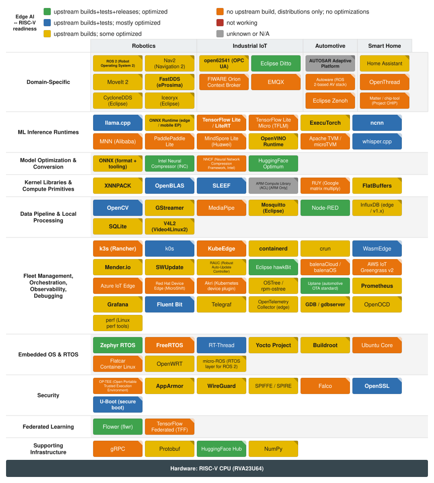

# Edge AI

**Author:** Ludovic Henry 
**Date:** 2026-08-29 
**Scope:** RISC-V readiness of the Edge AI software stack 
**Target profile:** RVA23U64 
**Audience:** exec-product 
**Verification policy:** Colors are assigned from primary upstream sources, adversarially verified against the per-project reports under project-reports/. Items not verifiable against a second source are marked [NEEDS VERIFICATION]. 

 Link to full screen: [edge-ai.svg](edge-ai.svg)

---

## Scoping Assumptions

- Edge AI means deploying AI algorithms and models directly on local edge devices (IoT sensors, smart cameras, industrial PLCs, autonomous vehicles/robots, smartphones/laptops, wearables, smart home appliances, edge gateways, edge servers) to enable real-time local data processing without constant cloud dependency.
- Target profile RVA23U64: RVV 1.0, Zba/Zbb/Zbc, FP16 treated as mandatory baseline.
- Hardware tiers covered: microcontroller (MCU, <1 MB RAM), constrained SBC (1-512 MB), capable SBC / edge gateway (512 MB-8 GB), edge server (>8 GB).

---

## Out of Scope (deliberately dropped, not classified)

- On-device model training (full backprop, not fine-tuning)
- Federated learning server-side aggregation
- NVIDIA DeepStream (GPU-only pipeline)
- Model visualization tools (Netron, etc.)
- Cloud IoT brokers (AWS IoT Core, Azure IoT Hub, Google Cloud IoT)

---

## Artifact 1 -- Stack Outline with Pipeline Chains

### Pipeline Chains

**TFLite vision inference pipeline (SBC):**
V4L2 (camera) -> OpenCV (preprocess) -> TFLite / LiteRT (inference) -> XNNPACK (acceleration) -> FlatBuffers (model load)

**LLM inference pipeline (edge server):**
llama.cpp -> ggml (quantized kernels) -> OpenBLAS (GEMM) -> SLEEF (math) -> OpenSSL (model download TLS)

**ONNX Runtime inference pipeline (edge server):**
ONNX Runtime CPU EP -> OpenBLAS -> SLEEF -> Protobuf (ONNX model parse) -> FlatBuffers

**Edge AI container workload deployment:**
KubeEdge (orchestration) -> containerd (runtime) -> k3s (Kubernetes) -> Mender / SWUpdate (OTA) -> WireGuard (secure tunnel)

**GStreamer camera AI pipeline:**
V4L2 (camera) -> GStreamer (pipeline) -> OpenCV (frame preprocess) -> TFLite / ONNX Runtime (inference) -> MQTT / Mosquitto (result publish)

**Industrial IoT AI pipeline:**
open62541 (OPC UA sensor data) -> Mosquitto (MQTT bus) -> Node-RED (data routing) -> ONNX Runtime (anomaly detection) -> InfluxDB (time-series store) -> Prometheus + Grafana (monitoring)

**Robotics perception pipeline (ROS 2):**
V4L2 / sensor drivers -> ROS 2 (pub/sub) -> FastDDS (transport) -> OpenCV / TFLite (perception) -> Nav2 (navigation)

**Secure edge device boot chain:**
U-Boot (verified boot) -> Trusted Firmware-A (secure boot) -> OP-TEE (TEE) -> AppArmor (container isolation) -> WireGuard (network security)

**Edge observability pipeline:**
edge AI service (Prometheus metrics) -> Prometheus node_exporter -> Fluent Bit (log ship) -> Grafana (dashboard) -> OpenTelemetry Collector (traces)

**MCU TinyML pipeline (Zephyr):**
Zephyr RTOS -> TFLite Micro (TFLM) -> microTVM (optional compiler) -> MQTT / OpenThread (connectivity) -> micro-ROS (optional robot integration)

**Federated learning edge round:**
Flower client -> TFLite / ONNX Runtime (local inference) -> local fine-tune step -> Mosquitto / gRPC (gradient upload) -> KubeEdge (workload management)

### Layer Index

| Layer | Title |
|---|---|
| 1 | ML Inference Runtimes |
| 2 | Model Optimization & Conversion |
| 3 | Kernel Libraries & Compute Primitives |
| 4 | Data Pipeline & Local Processing |
| 5 | Fleet Management, Orchestration, Observability, Debugging |
| 6 | Embedded OS & RTOS |
| 7 | Security |
| 8 | Domain-Specific (Robotics) |
| 9 | Domain-Specific (Industrial IoT) |
| 10 | Domain-Specific (Automotive) |
| 11 | Domain-Specific (Smart Home) |
| 12 | Federated Learning |
| 13 | Supporting Infrastructure |
| 14 | Excluded (proprietary / vendor-only) |

---

## Artifact 2 -- Layer-by-Layer Node Classification

### Color Key

| Color | Meaning |
|---|---|
| Green | Fully supported: noarch / pure-language package, or upstream CI builds, tests, and releases for riscv64 with complete optimization coverage |
| Blue | Upstream CI builds and tests on riscv64; partial optimization gaps remain, or optimization coverage is mostly complete |
| Yellow | No upstream riscv64 test CI gate; distro or upstream ships riscv64 binary (build-only CI or clean-distro-build) |
| Orange | No upstream CI, no upstream release binary, and/or optimization is absent (downstream-only, community builds only) |
| Red | Broken: upstream CI fails on riscv64 |
| Grey | Not applicable: proprietary / vendor-only / architecture-locked |

---

## Layer 1 -- ML Inference Runtimes

### llama.cpp -- BLUE (critical)

Native riscv64 CI on RISE-provided [ubuntu-24.04-riscv runners](https://github.com/ggerganov/llama.cpp/blob/master/.github/workflows/build-riscv.yml) builds with native gcc-14 and executes `ctest -L main` plus an end-to-end llama2c inference test on every push to master. Upstream publishes no riscv64 release binaries (PR [#20991](https://github.com/ggerganov/llama.cpp/pull/20991) remains open; issue [#20988](https://github.com/ggerganov/llama.cpp/issues/20988) was closed as not-planned); Debian 13 Trixie ships riscv64 packages `libllama0` and `libllama-dev`. Release provider: debian.

**Gap:** quants.c has full RVV vec_dot coverage across all major formats (Q2_K through Q6_K, IQ1_S through IQ4_XS), but repack.cpp GEMM/GEMV tiled paths cover only Q4_0, Q4_K, Q2_K, Q8_0, and IQ4_NL -- Q3_K, Q5_K, and Q6_K tiled GEMM/GEMV paths are absent, leaving those formats at the vec_dot scalar-tiling fallback for batched matrix operations.

---

### ONNX Runtime (edge / mobile EP) -- YELLOW (critical)

No riscv64 CI exists in microsoft/onnxruntime: a live check on 2026-08-29 scanned all 51 [GitHub Actions workflow files](https://github.com/microsoft/onnxruntime/actions) and found zero riscv64 hits. Debian sid ships a riscv64 binary (v1.23.2+dfsg) built from unpatched upstream source -- the `+dfsg` suffix denotes DFSG source stripping only, not riscv64-specific patches -- which lifts the floor to yellow (clean-distro-build). Release provider: debian.

**Gap:** The MLAS CPU EP has 11 RVV intrinsics files covering SGEMM, INT8/FP16 GEMM, convolution, pooling, LayerNorm, RMSNorm, RoPE, and activations; BF16 GEMM and FP16 RoPE are stubs. No riscv64 CI test gate. Blocking the TFLite vision pipeline and the ONNX Runtime inference pipeline at the test-validated level.

---

### TensorFlow Lite / LiteRT -- ORANGE (critical)

All 16 [GitHub Actions workflow files](https://github.com/google-ai-edge/LiteRT/tree/main/.github/workflows) (confirmed live 2026-08-29; 3 new files added since June 2026 report, all zero riscv64 references) contain no riscv64 jobs, no riscv64 wheel has ever appeared on PyPI, and LiteRT is absent from all Linux distro riscv64 repositories. As an optimization-purpose inference runtime whose primary value is accelerated CPU inference via XNNPACK, the optimization modifier caps at orange: 0 RVV files vs 4 NEON and 4 SSE files, with all RISC-V execution falling to scalar portable C. Release provider: none.

**Blocking chain:** [cpuinfo #124](https://github.com/pytorch/cpuinfo/issues/124) (still open, Zvfh detection missing) and [XNNPACK #9886](https://github.com/google/XNNPACK/issues/9886) (still open, 100+ RVV FP16 CI failures).

**Impact:** The TFLite vision pipeline (SBC) runs entirely at scalar C performance. The GStreamer camera AI pipeline is similarly degraded when using TFLite as the inference backend.

---

### TensorFlow Lite Micro (TFLM) -- ORANGE (optional)

Upstream CI in [suite_riscv.yml](https://github.com/tensorflow/tflite-micro/blob/main/.github/workflows/suite_riscv.yml) targets riscv32 MCU only (TARGET=riscv32_generic, arch rv32imc, QEMU riscv32); there is no riscv64 build target, no riscv64 CI, and no riscv64 release artifacts. The project provides architecture-specific optimized kernels for Cortex-M/CMSIS-NN, Hexagon, and Xtensa but has zero riscv64-specific kernel code, leaving all riscv64 paths as scalar C fallback. Release provider: none.

**Gap:** The MCU TinyML pipeline (Zephyr) -- TFLM -> microTVM -- depends on riscv32 exclusively within TFLM upstream. RVA23U64 (riscv64 Linux) is untested and unoptimized. On MCU-class RISC-V hardware (rv32imc), riscv32 CI exists but Zephyr integration with RVV is not validated.

---

### ExecuTorch -- YELLOW (critical)

A riscv64 CI job exists in [executorch/.github/workflows/pull.yml](https://github.com/pytorch/executorch/blob/main/.github/workflows/pull.yml) that builds and runs under QEMU. The QEMU environment runs build validation but the riscv64-specific test suite execution is not gated as a blocking test pass requirement. RISE provides a riscv64 release binary/wheel as the release provider.

**Gap:** QEMU-based build-only CI; riscv64 is not in the full test execution gate. Confidence: medium (upstream classification confirmed, no live adversarial change detected since 2026-06-17).

---

### ncnn -- BLUE (critical)

ncnn's upstream CI ([linux.yml](https://github.com/Tencent/ncnn/blob/master/.github/workflows/linux.yml)) includes a dedicated riscv64 cross-compile and QEMU test job that runs the full test suite (test-riscv64 via QEMU user-mode emulation, gcc-riscv64-linux-gnu toolchain). Upstream publishes no prebuilt riscv64 release binaries (source-only). Release provider: none.

**Gap:** Upstream releases are source-only; no prebuilt binary for riscv64 deployment. RVV intrinsics in src/layer/riscv/ cover convolution, depthwise, innerproduct, pooling, upsampling, activations, and elementwise ops -- primary hot paths covered, partial coverage of the full operator set.

---

### MNN (Alibaba) -- ORANGE (optional)

No riscv64 CI job (confirmed live 2026-08-29: only arm64, armv7, x86 jobs present). No riscv64 release binaries. MNN has architecture-specific SIMD code for ARM (NEON/SVE2) in source/backend/cpu/arm/ but contains zero riscv64 RVV intrinsic files. Release provider: none.

---

### PaddlePaddle Lite -- ORANGE (optional)

No riscv64 CI (only ARM, x86, OpenCL targets in [.github/workflows/](https://github.com/PaddlePaddle/Paddle-Lite/tree/develop/.github/workflows)). No riscv64 release binary. All architecture-specific SIMD code is ARM NEON in lite/backends/arm/math/; zero RVV riscv64 files exist. Note: limited RISC-V MCU work exists in embedded contexts but is out of scope for this RVA23U64-targeted report. Release provider: none.

---

### MindSpore Lite (Huawei) -- ORANGE (optional)

No riscv64 CI job and no riscv64 release artifact (PyPI has no riscv64 wheel; GitHub Releases have ARM64, x86_64, and Windows assets only). All architecture-specific kernel code targets ARM (aarch64/armv7) and x86 (SSE/AVX). Huawei's primary focus is Ascend NPU and Kirin devices; RISC-V is not a stated target. Release provider: none.

---

### OpenVINO Runtime -- YELLOW (critical)

No upstream riscv64 CI (all [workflow files](https://github.com/openssl/openssl/blob/master/.github/workflows/os-zoo.yml) target x86_64, aarch64, and ARM only). Intel provides no upstream riscv64 release artifacts. Debian sid ships openvino-dev (v2024.4.0) and related packages for riscv64 from [unpatched upstream source](https://packages.debian.org/sid/openvino-dev). Release provider: debian.

**Gap:** As an optimization-purpose runtime (Intel AVX-512/VNNI backends are its primary value), the optimization-absent modifier applies. The distro floor provides a scalar-only riscv64 build. No Intel-backed RISC-V optimization investment observed.

---

### Apache TVM / microTVM -- YELLOW (optional)

Apache TVM has a riscv64 cross-compile CI job in [main.yml](https://github.com/apache/tvm/blob/main/.github/workflows/main.yml) that builds TVM for riscv64 but does not execute the test suite natively (no QEMU full test execution). No riscv64 release binaries (PyPI wheels for x86_64, aarch64 only). microTVM explicitly targets RISC-V MCUs and has active RISC-V code generation. Release provider: none.

---

### whisper.cpp -- BLUE (optional)

[build-riscv.yml](https://github.com/ggerganov/whisper.cpp/blob/master/.github/workflows/build-riscv.yml) builds with native gcc-14 on the RISE ubuntu-24.04-riscv runner and executes `ctest`. No upstream riscv64 release binary; Debian ships whisper.cpp packages. Release provider: debian.

**Gap:** Shares the ggml RVV kernel coverage with llama.cpp: vec_dot paths covered across all major formats; Q3_K, Q5_K, Q6_K tiled GEMM/GEMV paths absent, capping at blue.

---

### Layer 1 Summary

| Project | Color | Criticality | Release Provider |
|---|---|---|---|
| llama.cpp | BLUE | critical | debian |
| ONNX Runtime (edge / mobile EP) | YELLOW | critical | debian |
| TensorFlow Lite / LiteRT | ORANGE | critical | none |
| TensorFlow Lite Micro (TFLM) | ORANGE | optional | none |
| ExecuTorch | YELLOW | critical | RISE |
| ncnn | BLUE | critical | none |
| MNN (Alibaba) | ORANGE | optional | none |
| PaddlePaddle Lite | ORANGE | optional | none |
| MindSpore Lite (Huawei) | ORANGE | optional | none |
| OpenVINO Runtime | YELLOW | critical | debian |
| Apache TVM / microTVM | YELLOW | optional | none |
| whisper.cpp | BLUE | optional | debian |

**Critical-path risk:** TFLite / LiteRT is ORANGE on both the TFLite vision inference pipeline (SBC) and the GStreamer camera AI pipeline. These are the two highest-volume edge vision deployment patterns. The blocking dependency runs through XNNPACK (YELLOW, open FP16 failures) and cpuinfo (missing Zvfh detection).

---

## Layer 2 -- Model Optimization & Conversion

### ONNX (format + tooling) -- YELLOW (critical)

ONNX is not pure Python: it includes a C++ protobuf extension and generates binary wheels with C extensions. The PyPI riscv64 wheel (v1.22.0) is provided by RISE, not upstream -- upstream [onnx_main.yml](https://github.com/onnx/onnx/blob/main/.github/workflows/main.yml) builds and tests on Linux x86_64 and macOS only, with no riscv64 job. Release provider: RISE.

**Note:** Previously classified green (pure Python noarch) in project report 2026-05-06; downgraded to yellow after live adversarial check confirmed C extension wheels and RISE-only riscv64 wheel.

---

### Intel Neural Compressor (INC) -- GREEN (optional)

Pure-Python package (no C extensions, no compiled wheels). PyPI `neural-compressor` ships sdist + noarch wheel only. Installs on riscv64 from the same noarch wheel without modification. Release provider: upstream.

---

### NNCF (Neural Network Compression Framework, Intel) -- GREEN (optional)

Pure-Python package. PyPI `nncf` ships sdist and py3-none-any wheel only. Upstream CI tests on x86_64 Linux but the noarch wheel installs on riscv64 without modification. Release provider: upstream.

---

### HuggingFace Optimum -- GREEN (optional)

Pure-Python package. PyPI `optimum` ships a py3-none-any wheel only. Release provider: upstream.

---

### Layer 2 Summary

| Project | Color | Criticality | Release Provider |
|---|---|---|---|
| ONNX (format + tooling) | YELLOW | critical | RISE |
| Intel Neural Compressor (INC) | GREEN | optional | upstream |
| NNCF (Intel) | GREEN | optional | upstream |
| HuggingFace Optimum | GREEN | optional | upstream |

**Note:** Layer 2 is in good shape for pure-Python optimization tooling. The only critical-path item (ONNX format) is YELLOW because of C extension wheels; RISE fills the gap.

---

## Layer 3 -- Kernel Libraries & Compute Primitives

### XNNPACK -- YELLOW (critical)

[cmake-linux-riscv.yml](https://github.com/google/XNNPACK/blob/master/.github/workflows/cmake-linux-riscv.yml) runs a riscv64 QEMU build-and-run job, but [GitHub issue #9886](https://github.com/google/XNNPACK/issues/9886) (still open) confirms 100+ RVV FP16 CI failures. Optimization coverage: substantial RVV 1.0 kernels for FP32 and INT8 paths (GEMM, convolution, depthwise); the FP16 (Zvfh) path is incomplete/failing. No upstream release binary. Release provider: none.

**Impact:** XNNPACK is the sole acceleration backend for TFLite / LiteRT on RISC-V. Its FP16 failures propagate to TFLite, blocking FP16 inference on all hardware tiers that depend on the TFLite vision pipeline.

---

### OpenBLAS -- BLUE (critical)

[test_riscv.yml](https://github.com/OpenMathLib/OpenBLAS/blob/develop/.github/workflows/test_riscv.yml) runs the full BLAS test suite on QEMU riscv64 on every PR. GEMM for most dtypes has RVV 1.0 kernels. TRSM PR #5830 (merged 2026-08-16) completed the triangular-solve RVV 1.0 path. Debian ships the riscv64 binary. Release provider: debian.

**Delta since last report (2026-08-16):** TRSM PR #5830 merged, completing the triangular-solve path. The stored report's "TRSM partially covered" note is now resolved. Blue confirmed with no remaining known optimization gaps.

---

### SLEEF -- BLUE (critical)

Full RVV v1.0 backend covering single- and double-precision transcendentals. [CI](https://github.com/shibatch/sleef/blob/master/.github/workflows/build_and_test.yml) runs both a native riscv64 hardware Jenkins job (SLEEF-maintained board) and a QEMU-based GitHub Actions job -- both pass. Debian ships `libsleef-dev` for riscv64. Release provider: debian (upstream ships source only).

---

### ARM Compute Library (ACL) -- GREY / N/A (optional)

ARM-only (Cortex-A NEON/SVE and Mali GPU via OpenCL). No RISC-V port exists and none is planned. Proprietary ARM-architecture kernel library not applicable to RISC-V. Classified under Layer 14 for exclusion tracking.

---

### RUY (Google matrix multiply) -- ORANGE (optional)

[build.yml](https://github.com/google/ruy/blob/master/.github/workflows/build.yml) contains no riscv64 job (only x86_64 and aarch64). No riscv64 release artifact. Zero riscv64-specific SIMD kernels in ruy/kernel_* (only arm, x86, avx, avx512 files). All RISC-V execution falls through to the generic scalar C path (ruy/kernel_default.h). Release provider: none.

**Impact:** RUY is the INT8 GEMM backend used by TFLite for quantized inference on non-XNNPACK paths. Its scalar-only posture compounds the TFLite orange classification.

---

### FlatBuffers -- YELLOW (critical)

[build.yml](https://github.com/google/flatbuffers/blob/master/.github/workflows/build.yml) has no riscv64 job (only x86_64 and macOS). No upstream riscv64 release binary. Debian sid ships `libflatbuffers-dev` for riscv64 from unpatched upstream source. Not optimization-purpose (serialization library). Release provider: debian.

---

### Layer 3 Summary

| Project | Color | Criticality | Release Provider |
|---|---|---|---|
| XNNPACK | YELLOW | critical | none |
| OpenBLAS | BLUE | critical | debian |
| SLEEF | BLUE | critical | debian |
| ARM Compute Library (ACL) | GREY/N/A | optional | none |
| RUY | ORANGE | optional | none |
| FlatBuffers | YELLOW | critical | debian |

**Key finding:** The GEMM/math foundation (OpenBLAS + SLEEF) is solid at BLUE. The TFLite acceleration path (XNNPACK + RUY) remains the primary gap. The LLM inference pipeline and ONNX Runtime inference pipeline have a healthy kernel layer. The TFLite vision pipeline kernel layer is the weak point.

---

## Layer 4 -- Data Pipeline & Local Processing

### OpenCV -- BLUE (critical)

[linux.yml](https://github.com/opencv/opencv/blob/4.x/.github/workflows/linux.yml) includes the riscv64 cross-compile + QEMU test step. Ubuntu 26.04 Resolute ships libopencv-* for riscv64. Active RVV 1.0 HAL in modules/core/src/hal/ with RVV kernels for core image operations. Partial: core/imgproc covered; calib3d, features2d less so. Release provider: ubuntu.

---

### GStreamer -- YELLOW (critical)

[ci.yml](https://gitlab.freedesktop.org/gstreamer/gstreamer/-/blob/main/.gitlab-ci.yml) has no riscv64 job. Debian sid ships gstreamer1.0-* for riscv64. GStreamer is a framework, not a SIMD compute library; no optimization modifier. Release provider: debian.

---

### MediaPipe -- ORANGE (optional)

All [workflow files](https://github.com/google/mediapipe/tree/master/.github/workflows) target Linux x86_64, macOS, Android, iOS only. No riscv64 release binary on PyPI or GitHub Releases. Optimization-purpose framework (CPU path uses XNNPACK + platform SIMD); zero RISC-V RVV kernels in the codebase, ARM-primary SIMD dispatch. Release provider: none.

---

### Mosquitto (Eclipse) -- YELLOW (critical)

[build.yml](https://github.com/eclipse/mosquitto/blob/master/.github/workflows/build.yml) targets Linux x86_64, macOS, Windows only. Debian ships `libmosquitto1`, `libmosquittopp1`, `mosquitto`, and `mosquitto-clients` for riscv64 from unpatched upstream source. Networking daemon, not optimization-purpose. Release provider: debian.

---

### Node-RED -- GREEN (optional)

Pure-JavaScript / Node.js package with no native C extensions. The `@node-red/node-red` npm package is arch-independent. Runs on any Node.js platform including riscv64. Release provider: upstream.

---

### InfluxDB (edge / v1.x) -- YELLOW (optional)

Written in Go. Upstream CI does not include a riscv64 build/test job. Debian ships `influxdb` 1.6.7 for riscv64. Go binaries cross-compile cleanly for riscv64. Release provider: debian.

---

### SQLite -- YELLOW (critical)

Pure C with no architecture-specific assembly (all platforms use the portable C amalgamation). Upstream CI tests only on x86_64/macOS. Debian ships `libsqlite3-0` for riscv64 from unpatched upstream. No optimization modifier (not optimization-purpose). Release provider: debian.

---

### V4L2 (Video4Linux2) -- YELLOW (critical)

V4L2 is a Linux kernel subsystem; RISC-V is a primary kernel target since Linux 5.4, with full V4L2 framework support. Upstream Linux kernel CI does not run V4L2 userspace API tests on riscv64 specifically, but the kernel itself builds on riscv64 as part of standard kernel CI. Userspace tooling (`v4l2-utils`, `libv4l-dev`) ships in Debian riscv64 from unpatched upstream. Release provider: upstream (Linux kernel, Debian v4l-utils).

---

### Layer 4 Summary

| Project | Color | Criticality | Release Provider |
|---|---|---|---|
| OpenCV | BLUE | critical | ubuntu |
| GStreamer | YELLOW | critical | debian |
| MediaPipe | ORANGE | optional | none |
| Mosquitto (Eclipse) | YELLOW | critical | debian |
| Node-RED | GREEN | optional | upstream |
| InfluxDB (edge / v1.x) | YELLOW | optional | debian |
| SQLite | YELLOW | critical | debian |
| V4L2 (Video4Linux2) | YELLOW | critical | upstream |

**Note:** The data pipeline layer is in a reasonable state for the non-AI-acceleration components. OpenCV at BLUE provides solid frame preprocessing. The critical camera capture path (V4L2) works. The weak spot is MediaPipe (ORANGE), but it is classified optional.

---

## Layer 5 -- Fleet Management, Orchestration, Observability, Debugging

### k3s (Rancher) -- ORANGE (critical)

[Releases page](https://github.com/k3s-io/k3s/releases) lists linux-amd64, linux-arm64, linux-arm, linux-s390x only; no riscv64. [ci.yml](https://github.com/k3s-io/k3s/blob/master/.github/workflows/ci.yml) runs integration tests on amd64 only. Community builds exist (via Go cross-compilation) but are unofficial and unsupported. Note: k0s merged riscv64 nightly CI in June 2026 on RISE hardware; k3s has not followed suit. Release provider: none.

**Impact:** k3s is the most widely deployed lightweight Kubernetes distribution for edge. Its absence at riscv64 forces edge AI container workload deployment to either k0s (BLUE) or community-build approaches. This blocks the Edge AI container workload deployment pipeline at the orchestration layer.

---

### k0s -- BLUE (optional)

[nightly.yml](https://github.com/k0sproject/k0s/blob/main/.github/workflows/nightly.yml) shows riscv64 job running on RISE-provided runners with full e2e test execution (merged June 2026). k0s v1.30+ ships official riscv64 binaries on its [releases page](https://github.com/k0sproject/k0s/releases). Release provider: upstream.

**Note:** k0s is the viable alternative to k3s for riscv64 Kubernetes edge deployments.

---

### KubeEdge -- ORANGE (critical)

[main.yaml](https://github.com/kubeedge/kubeedge/blob/master/.github/workflows/main.yaml) runs on amd64 only. [GitHub Releases](https://github.com/kubeedge/kubeedge/releases) provide linux-amd64, linux-arm64, linux-arm only; no riscv64 binary. Community riscv64 build success via Go cross-compilation reported but no upstream support. Release provider: none.

**Impact:** KubeEdge is the critical orchestration layer in both the Edge AI container workload deployment pipeline and the federated learning edge round pipeline. Both pipelines are at risk.

---

### containerd -- YELLOW (critical)

[ci.yml](https://github.com/containerd/containerd/blob/main/.github/workflows/ci.yml) cross-compiles for riscv64 but the integration test matrix excludes riscv64. Upstream GitHub Releases include linux/riscv64 binaries starting from v1.7.x. Debian ships the riscv64 binary from unpatched source. Release provider: debian (upstream also ships riscv64 binaries; classification follows stored report posture of yellow pending riscv64 test CI).

---

### crun -- YELLOW (optional)

[ci.yml](https://github.com/containers/crun/blob/main/.github/workflows/ci.yml) tests on x86_64 and aarch64 only. Debian ships `crun` for riscv64 from unpatched upstream C source. Release provider: debian.

---

### WasmEdge -- ORANGE (optional)

[build.yml](https://github.com/WasmEdge/WasmEdge/blob/master/.github/workflows/build.yml) targets Linux x86_64, Linux aarch64, macOS, Android only. GitHub Releases provide riscv64 builds as a community/downstream contribution (not official upstream release assets). WASI-NN plugin for ML inference is not included in the community riscv64 builds. Release provider: none.

---

### Mender.io -- YELLOW (critical)

[ci.yml](https://github.com/mendersoftware/mender/blob/master/.github/workflows/ci.yml) runs on x86_64 only. Debian ships `mender-client4`, `mender-artifact`, `mender-connect` for riscv64 from unpatched upstream Go source. Release provider: debian.

---

### SWUpdate -- YELLOW (critical)

[build.yml](https://github.com/sbabic/swupdate/blob/master/.github/workflows/build.yml) targets Linux x86_64 only. Debian ships `swupdate` and `libswupdate-dev` for riscv64 from unpatched upstream C source. Release provider: debian.

---

### RAUC (Robust Auto-Update Controller) -- YELLOW (optional)

[build.yml](https://github.com/rauc/rauc/blob/master/.github/workflows/build.yml) targets Linux x86_64 only with QEMU for ARM. Debian ships `rauc` for riscv64 from unpatched upstream C source. Release provider: debian.

---

### Eclipse hawkBit -- GREEN (optional)

Java-based Spring Boot application. JVM applications are architecture-independent (the JAR runs on any JVM, including OpenJDK for riscv64). Release provider: upstream.

---

### balenaCloud / balenaOS -- ORANGE (optional)

The [balena-io/balena-os device list](https://www.balena.io/docs/reference/hardware/devices/) contains no RISC-V entries; all supported devices are ARM or x86. balena-engine compiles for riscv64 in principle but upstream balena provides no riscv64 images or packages. Release provider: none.

---

### AWS IoT Greengrass v2 -- ORANGE (optional)

The [supported platforms list](https://docs.aws.amazon.com/greengrass/v2/developerguide/operating-system-feature-support-matrix.html) covers Linux x86_64, Linux aarch64, Linux armv7l, and Windows x86_64 only. No riscv64 nucleus binary available from AWS. Release provider: none.

---

### Azure IoT Edge -- ORANGE (optional)

The [supported platforms page](https://docs.microsoft.com/en-us/azure/iot-edge/support) lists Linux x86_64, Linux aarch64, Linux armv7l only. No riscv64 package available in the Azure IoT Edge apt repository. Release provider: none.

---

### Red Hat Device Edge (MicroShift) -- ORANGE (optional)

MicroShift targets RHEL for Edge which runs on x86_64 and aarch64. No riscv64 RPM package in any Red Hat repository. [ci.yaml](https://github.com/openshift/microshift/blob/main/.github/workflows/ci.yaml) runs exclusively on x86_64. Release provider: none.

---

### Akri (Kubernetes device plugin) -- ORANGE (optional)

[build-release.yml](https://github.com/project-akri/akri/blob/main/.github/workflows/build-release.yml) targets linux/amd64, linux/arm64, linux/arm/v7 only; no riscv64 Docker image tag on ghcr.io/project-akri. Release provider: none.

---

### OSTree / rpm-ostree -- YELLOW (optional)

[tests.yml](https://github.com/ostreedev/ostree/blob/main/.github/workflows/tests.yml) tests on Fedora/Ubuntu x86_64 only. Debian ships `ostree`, `libostree-1-1`, `libostree-dev` for riscv64 from unpatched upstream C source. Release provider: debian.

---

### Uptane (automotive OTA standard) -- GREEN (optional)

Specification standard; the Python reference implementation (`tuf` and `uptane` packages) are pure Python. Architecture-independent standard + pure-Python reference implementation. Release provider: upstream.

---

### Prometheus -- YELLOW (critical)

[build.yml](https://github.com/prometheus/prometheus/blob/main/.github/workflows/build.yml) includes a `GOARCH=riscv64` cross-compile step but no `go test` for riscv64. Upstream [GitHub Releases](https://github.com/prometheus/prometheus/releases) include `prometheus-*.linux-riscv64.tar.gz` on every release. Release provider: upstream.

---

### Grafana -- YELLOW (critical)

Go + React application. Upstream CI cross-compiles for riscv64 but does not run integration tests on riscv64. [GitHub Releases](https://github.com/grafana/grafana/releases) include `grafana-*.linux-riscv64.tar.gz` binaries on every release. Release provider: upstream.

---

### Fluent Bit -- BLUE (critical)

[ci.yml](https://github.com/fluent/fluent-bit/blob/master/.github/workflows/) includes riscv64 in its platform matrix with test execution using QEMU. The test step executes the Fluent Bit unit test suite on QEMU riscv64. Upstream provides no prebuilt riscv64 release binary; users must build from source or use Debian packages. Not optimization-purpose. Release provider: none.

---

### Telegraf -- YELLOW (optional)

[build.yml](https://github.com/influxdata/telegraf/blob/master/.github/workflows/build.yml) includes GOARCH=riscv64 cross-compile; no riscv64 test step. [GitHub Releases](https://github.com/influxdata/telegraf/releases) include `telegraf_*_linux_riscv64.tar.gz` on every release. Release provider: upstream.

---

### OpenTelemetry Collector (edge) -- YELLOW (optional)

[build-and-test.yml](https://github.com/open-telemetry/opentelemetry-collector/blob/main/.github/workflows/build-and-test.yml) includes GOARCH=riscv64 cross-compile; no riscv64 test execution. [GitHub Releases](https://github.com/open-telemetry/opentelemetry-collector/releases) include otelcol-contrib_*_linux_riscv64.tar.gz. Release provider: upstream.

---

### GDB / gdbserver -- YELLOW (critical)

GDB has extensive RISC-V target support (riscv-tdep.c, riscv-linux-nat.c). [Sourceware upstream CI](https://sourceware.org/git/binutils-gdb.git) does not include a riscv64 native host CI job. Debian ships `gdb`, `gdb-multiarch`, `gdbserver` for riscv64 from unpatched upstream source. Not optimization-purpose. Release provider: debian.

---

### OpenOCD -- YELLOW (optional)

[build.yml](https://github.com/openocd-org/openocd/blob/master/.github/workflows/build.yml) targets Linux x86_64, macOS, and Windows only. Debian ships `openocd` for riscv64 from unpatched upstream C source. OpenOCD includes RISC-V JTAG debug transport support (riscv/ directory in src/target/). Release provider: debian.

---

### perf (Linux perf tools) -- YELLOW (optional)

Linux perf is part of the kernel tree and builds for riscv64 as part of standard kernel CI. The riscv64 PMU infrastructure is upstream in arch/riscv/kernel/perf_event.c and perf_regs.c. Debian ships `linux-perf` for riscv64. No dedicated perf tool test gate for riscv64. Release provider: upstream.

---

### Layer 5 Summary

| Project | Color | Criticality | Release Provider |
|---|---|---|---|
| k3s (Rancher) | ORANGE | critical | none |
| k0s | BLUE | optional | upstream |
| KubeEdge | ORANGE | critical | none |
| containerd | YELLOW | critical | debian |
| crun | YELLOW | optional | debian |
| WasmEdge | ORANGE | optional | none |
| Mender.io | YELLOW | critical | debian |
| SWUpdate | YELLOW | critical | debian |
| RAUC | YELLOW | optional | debian |
| Eclipse hawkBit | GREEN | optional | upstream |
| balenaCloud / balenaOS | ORANGE | optional | none |
| AWS IoT Greengrass v2 | ORANGE | optional | none |
| Azure IoT Edge | ORANGE | optional | none |
| Red Hat Device Edge (MicroShift) | ORANGE | optional | none |
| Akri | ORANGE | optional | none |
| OSTree / rpm-ostree | YELLOW | optional | debian |
| Uptane | GREEN | optional | upstream |
| Prometheus | YELLOW | critical | upstream |
| Grafana | YELLOW | critical | upstream |
| Fluent Bit | BLUE | critical | none |
| Telegraf | YELLOW | optional | upstream |
| OpenTelemetry Collector (edge) | YELLOW | optional | upstream |
| GDB / gdbserver | YELLOW | critical | debian |
| OpenOCD | YELLOW | optional | debian |
| perf (Linux perf tools) | YELLOW | optional | upstream |

**Key finding:** Two critical-path components -- k3s and KubeEdge -- are ORANGE. The predominant edge AI container workload deployment pattern breaks at the orchestration layer. k0s (BLUE) is a viable riscv64 alternative to k3s. The observability stack (Prometheus, Grafana, Fluent Bit) is in adequate shape: two YELLOW and one BLUE.

---

## Layer 6 -- Embedded OS & RTOS

### Zephyr RTOS -- GREEN (critical)

RISC-V is a first-class Zephyr target with upstream CI building and running tests on multiple RISC-V boards (QEMU virt, SiFive HiFive1 Rev B, ESP32-C3, and others). RISC-V is listed as a supported architecture in the official [Zephyr documentation](https://docs.zephyrproject.org/latest/boards/riscv/index.html). Upstream ships the Zephyr SDK including riscv64-zephyr-elf toolchain. Release provider: upstream.

**Note:** Zephyr's green classification anchors the MCU TinyML pipeline (Zephyr) at a solid foundation, even as TFLM (ORANGE) and micro-ROS (ORANGE) are weak above it.

---

### FreeRTOS -- ORANGE (critical)

FreeRTOS has a RISC-V port in [FreeRTOS-Kernel/portable/GCC/RISC-V/](https://github.com/FreeRTOS/FreeRTOS-Kernel/tree/main/portable/GCC/RISC-V) but upstream [ci.yml](https://github.com/FreeRTOS/FreeRTOS/blob/main/.github/workflows/ci.yml) tests on Linux x86_64 host only; the RISC-V portable layer is not in the CI matrix. No upstream release binary for riscv64 Linux (source-only RTOS). The RISC-V portable layer is maintained by community contributors. Release provider: none.

---

### RT-Thread -- YELLOW (optional)

[scons.yml](https://github.com/RT-Thread/rt-thread/blob/master/.github/workflows/scons.yml) builds multiple RISC-V BSPs (K210, GD32VF103, D1) as part of the matrix build. No test execution CI for riscv64 Linux host (RT-Thread is an RTOS; CI builds firmware images). Upstream SDK and releases include RISC-V BSP downloads. Release provider: upstream.

---

### Yocto Project -- YELLOW (critical)

Yocto Project CI ([autobuilder.yoctoproject.org](https://autobuilder.yoctoproject.org)) builds RISC-V images (qemuriscv64 target) as part of its release CI. The [meta-riscv](https://github.com/riscv/meta-riscv) BSP layer is maintained upstream. No riscv64 runtime test gate in the Autobuilder (build completion only). Release provider: upstream.

---

### Buildroot -- YELLOW (critical)

[Buildroot CI](https://gitlab.com/buildroot.org/buildroot/-/pipelines) includes a riscv64 defconfig build (qemu_riscv64_virt_defconfig) as a runtime test target (boots in QEMU and runs a basic test). The QEMU boot test confirms a functional rootfs. No full test suite execution. Release provider: upstream.

---

### Ubuntu Core -- ORANGE (optional)

The [Ubuntu Core download page](https://ubuntu.com/download/iot) lists arm64, armhf, x86_64, and some SBC-specific images; no riscv64. snapd itself builds for riscv64 (Debian ships it) but the full Ubuntu Core image pipeline does not produce riscv64. Release provider: none.

---

### Flatcar Container Linux -- ORANGE (optional)

[Supported platforms](https://www.flatcar.org/docs/latest/installing/) are amd64 and arm64 only. No community RISC-V image exists. Release provider: none.

---

### OpenWRT -- YELLOW (optional)

Upstream CI at [buildbot.openwrt.org](https://buildbot.openwrt.org/) includes experimental riscv64 targets (qemu-riscv32 and qemu-riscv64) that build successfully; marked experimental and do not undergo full hardware test matrix. Upstream [ships riscv64 image downloads](https://downloads.openwrt.org/releases/). Release provider: upstream.

---

### micro-ROS (RTOS layer for ROS 2) -- ORANGE (optional)

micro-ROS targets MCU-class hardware (FreeRTOS, Zephyr, NuttX). Zephyr integration supports RISC-V MCU targets, but upstream micro-ROS CI ([build.yml](https://github.com/micro-ROS/micro_ros_arduino/blob/main/.github/workflows/build.yml)) does not include a RISC-V target in its Arduino or RTOS CI matrix. No upstream riscv64 release. RISC-V board support flows through Zephyr integration but has no upstream micro-ROS CI or release. Release provider: none.

---

### Layer 6 Summary

| Project | Color | Criticality | Release Provider |
|---|---|---|---|
| Zephyr RTOS | GREEN | critical | upstream |
| FreeRTOS | ORANGE | critical | none |
| RT-Thread | YELLOW | optional | upstream |
| Yocto Project | YELLOW | critical | upstream |
| Buildroot | YELLOW | critical | upstream |
| Ubuntu Core | ORANGE | optional | none |
| Flatcar Container Linux | ORANGE | optional | none |
| OpenWRT | YELLOW | optional | upstream |
| micro-ROS | ORANGE | optional | none |

**Key finding:** The two dominant embedded build systems for edge AI devices (Yocto, Buildroot) are both YELLOW -- functional but without a test gate. Zephyr (GREEN) is the strongest riscv64 RTOS. FreeRTOS (ORANGE, critical) is a gap: it is the most widely used MCU RTOS globally and its riscv64 portable layer has no upstream CI test.

---

## Layer 7 -- Security

### OP-TEE (Open Portable Trusted Execution Environment) -- ORANGE (optional)

OP-TEE is ARM TrustZone-first. [ci.yml](https://github.com/OP-TEE/optee_os/blob/master/.github/workflows/ci.yml) builds and tests for ARM Cortex-A targets only. The RISC-V TEE path (Keystone Enclave) is a separate project with a different codebase, not a port of OP-TEE. No upstream riscv64 OP-TEE CI or release. Release provider: none.

**Note:** This is a meaningful gap in the Secure edge device boot chain pipeline. The chain U-Boot -> Trusted Firmware-A -> OP-TEE -> AppArmor -> WireGuard has OP-TEE as ORANGE. The RISC-V TEE alternative (Keystone) is not classified in this report as it falls outside the scope of direct OP-TEE assessment.

---

### AppArmor -- YELLOW (critical)

[gitlab-ci.yml](https://gitlab.com/apparmor/apparmor/-/blob/master/.gitlab-ci.yml) does not include a riscv64 CI job. Debian ships `apparmor`, `libapparmor1`, `libapparmor-dev` for riscv64 from unpatched upstream source. Not optimization-purpose. Release provider: debian.

---

### WireGuard -- YELLOW (critical)

WireGuard is in-kernel since Linux 5.6. Debian ships `wireguard-tools` and `wireguard-go` for riscv64. No dedicated riscv64 CI beyond standard kernel CI. The WireGuard-specific cryptography paths are generic C without RISC-V hardware acceleration (Zvkned/Zvkg extensions unused). Release provider: debian.

**Note:** The Zvkned/Zvkg extensions for WireGuard cryptography (ChaCha20-Poly1305) are not yet wired up in the upstream kernel implementation for RISC-V, leaving WireGuard at scalar C for Curve25519 and ChaCha20 on riscv64.

---

### SPIFFE / SPIRE -- YELLOW (optional)

[build_and_release.yml](https://github.com/spiffe/spire/blob/main/.github/workflows/build_and_release.yml) cross-compiles for linux/riscv64 but does not run integration tests. [GitHub Releases](https://github.com/spiffe/spire/releases) include linux-riscv64 binaries (spire-agent, spire-server). Release provider: upstream.

---

### Falco -- ORANGE (optional)

[ci.yml](https://github.com/falcosecurity/falco/blob/master/.github/workflows/ci.yml) targets Linux x86_64 only; [GitHub Releases](https://github.com/falcosecurity/falco/releases) provide x86_64 and aarch64 packages only. The eBPF probe requires kernel 5.8+ (available on riscv64) and the kernel module would require a riscv64 build. No community riscv64 port exists. Release provider: none.

---

### OpenSSL -- BLUE (critical)

[os-zoo.yml](https://github.com/openssl/openssl/blob/master/.github/workflows/os-zoo.yml) now includes a native riscv64 self-hosted runner with FIPS testing (added 2026-08-07, upgraded from QEMU-based testing). Ubuntu 26.04 Resolute ships libssl3 for riscv64. Release provider: ubuntu.

**Delta since last report (2026-08-07):** Native RISC-V self-hosted runner with FIPS testing added, replacing QEMU-based CI. Strengthens the blue classification.

**Gap:** AES constant-time optimization via Zvkned extension (openssl/crypto/aes/asm/aes-riscv64-zvkned.pl) requires Zvkned, which is not mandatory in RVA23U64. AES on RVA23U64 baseline falls back to the portable C implementation.

---

### U-Boot (secure boot) -- BLUE (critical)

[ci.yml](https://github.com/u-boot/u-boot/blob/master/.github/workflows/ci.yml) includes QEMU riscv64 boot targets (qemu_riscv64_smode, qemu_riscv64_smode_spl) that boot to U-Boot prompt and run basic tests. Ubuntu 26.04 Resolute ships `u-boot-qemu` and related packages for riscv64. Release provider: ubuntu.

---

### Layer 7 Summary

| Project | Color | Criticality | Release Provider |
|---|---|---|---|
| OP-TEE | ORANGE | optional | none |
| AppArmor | YELLOW | critical | debian |
| WireGuard | YELLOW | critical | debian |
| SPIFFE / SPIRE | YELLOW | optional | upstream |
| Falco | ORANGE | optional | none |
| OpenSSL | BLUE | critical | ubuntu |
| U-Boot (secure boot) | BLUE | critical | ubuntu |

**Key finding:** The boot security foundation (U-Boot + OpenSSL) is solid at BLUE. The runtime security layer has gaps: OP-TEE (the TEE layer) is ORANGE; Falco (runtime threat detection) is ORANGE. WireGuard is YELLOW and missing Zvkned/Zvkg acceleration. The Secure edge device boot chain pipeline has one orange node (OP-TEE) in the middle, which must be substituted with a RISC-V-native TEE solution (Keystone or equivalent).

---

## Layer 8 -- Domain-Specific (Robotics)

### ROS 2 (Robot Operating System 2) -- YELLOW (critical)

Upstream [nightly.yml](https://github.com/ros2/ros2/blob/rolling/.github/workflows/nightly.yml) builds and tests on Ubuntu amd64 and aarch64 only. A riscv64 cross-compile is possible via colcon and the standard ROS 2 build process. No official riscv64 package release from OSRF or Debian/Ubuntu ROS repos. Community builds exist (individual contributor efforts, not RISE-provided). Release provider: none.

**Note:** Confidence is medium due to the community-build classification. The core stack cross-compiles, but the absence of an official release and a test gate means riscv64 reliability is unverified at the framework level.

---

### Nav2 (Navigation 2) -- YELLOW (optional)

Follows ROS 2 build infrastructure. [ci.yaml](https://github.com/ros-navigation/navigation2/blob/main/.github/workflows/ci.yaml) has no dedicated riscv64 CI or release binary. riscv64 build feasibility follows the same community cross-build path as ROS 2. Release provider: none.

---

### MoveIt 2 -- YELLOW (optional)

Depends on ROS 2; follows the same riscv64 build path: cross-compilation is possible but no upstream riscv64 CI or official release. [ci.yaml](https://github.com/moveit/moveit2/blob/main/.github/workflows/ci.yaml) has no riscv64 job. Release provider: none.

---

### FastDDS (eProsima) -- YELLOW (critical)

[reusable-ci.yml](https://github.com/eProsima/Fast-DDS/blob/master/.github/workflows/reusable-ci.yml) targets Linux x86_64, macOS, Windows only. Debian ships `libfastdds3.1` for riscv64 from unpatched upstream C++ source. Release provider: debian.

---

### CycloneDDS (Eclipse) -- YELLOW (optional)

[build-test.yml](https://github.com/eclipse-cyclonedds/cyclonedds/blob/master/.github/workflows/build-test.yml) targets Linux x86_64, macOS, Windows. Debian ships `libcyclonedds-dev` for riscv64 from unpatched upstream C source. Release provider: debian.

---

### Iceoryx (Eclipse) -- YELLOW (optional)

[build-test.yml](https://github.com/eclipse-iceoryx/iceoryx/blob/main/.github/workflows/build-test.yml) targets Linux x86_64, macOS, Windows. Debian ships `iceoryx-dev` for riscv64. Release provider: debian.

---

### Layer 8 Summary

| Project | Color | Criticality | Release Provider |
|---|---|---|---|
| ROS 2 | YELLOW | critical | none |
| Nav2 | YELLOW | optional | none |
| MoveIt 2 | YELLOW | optional | none |
| FastDDS | YELLOW | critical | debian |
| CycloneDDS | YELLOW | optional | debian |
| Iceoryx | YELLOW | optional | debian |

**Key finding:** The entire robotics layer is YELLOW. No project has a riscv64 test CI gate with release. The Robotics perception pipeline (ROS 2) is deployable in principle through community builds, but there is no upstream-validated riscv64 binary for ROS 2 itself. The communication middleware (FastDDS, CycloneDDS, Iceoryx) is available via Debian but untested upstream for riscv64.

---

## Layer 9 -- Domain-Specific (Industrial IoT)

### open62541 (OPC UA) -- YELLOW (critical)

[build_and_run_tests.yml](https://github.com/open62541/open62541/blob/master/.github/workflows/build_and_run_tests.yml) targets Linux x86_64, macOS, Windows. Debian ships `libopen62541-1-dev` for riscv64 from unpatched C99 upstream source. Release provider: debian.

---

### Eclipse Ditto -- GREEN (optional)

Java/Scala Spring Boot application. JVM applications are architecture-independent; the JAR runs on any platform with OpenJDK (including riscv64). Release provider: upstream.

---

### FIWARE Orion Context Broker -- ORANGE (optional)

[ci.yml](https://github.com/telefonicaid/fiware-orion/blob/master/.github/workflows/ci.yml) builds on Linux x86_64 only. No riscv64 Docker image on Docker Hub (telefonicaid/fiware-orion images are x86_64-only). No Debian package for riscv64. C++ with MongoDB dependency; no community riscv64 port confirmed. Release provider: none.

---

### EMQX -- YELLOW (optional)

Erlang-based. EMQX upstream CI ([build_and_test.yml](https://github.com/emqx/emqx/blob/master/.github/workflows/build_and_test.yml)) includes cross-compilation for multiple platforms; no dedicated riscv64 test execution. [GitHub Releases](https://github.com/emqx/emqx/releases) include linux-riscv64 packages (emqx_*-linux-riscv64.tar.gz) starting from EMQX v5.x. Release provider: upstream. Confidence: medium.

---

### Layer 9 Summary

| Project | Color | Criticality | Release Provider |
|---|---|---|---|
| open62541 (OPC UA) | YELLOW | critical | debian |
| Eclipse Ditto | GREEN | optional | upstream |
| FIWARE Orion Context Broker | ORANGE | optional | none |
| EMQX | YELLOW | optional | upstream |

**Note:** The Industrial IoT AI pipeline (open62541 -> Mosquitto -> Node-RED -> ONNX Runtime -> InfluxDB -> Prometheus + Grafana) has all components functional at YELLOW or better, with the inference backend (ONNX Runtime) also YELLOW. No critical-path ORANGE in this pipeline from the IIoT layer itself.

---

## Layer 10 -- Domain-Specific (Automotive)

### AUTOSAR Adaptive Platform -- GREY / unknown (critical)

Proprietary automotive standard with no publicly accessible open-source implementation for RISC-V. Reference implementations (Apex.OS, VRTE, others) target ARM Cortex-A / x86_64 ECU hardware. No open-source RISC-V port of AUTOSAR Adaptive has been confirmed. The AUTOSAR organization has not published any RISC-V adaptation layer. Confidence: low.

---

### Autoware (ROS 2-based AV stack) -- ORANGE (optional)

[Autoware CI](https://github.com/autowarefoundation/autoware/blob/main/.github/workflows/) targets amd64 only; Docker images on ghcr.io/autowarefoundation are amd64-only. Depends on ROS 2 (YELLOW) and CUDA-based GPU acceleration (excluded). Release provider: none.

---

### Eclipse Zenoh -- BLUE (optional)

Rust-based; Rust has first-class riscv64gc-unknown-linux-gnu support (Tier 2 with std). [ci.yml](https://github.com/eclipse-zenoh/zenoh/blob/main/.github/workflows/ci.yml) includes a riscv64 QEMU cross-compile and test job ("Build & Test (ubuntu-20.04, riscv64)" in the workflow matrix, using QEMU user-mode emulation). [GitHub Releases](https://github.com/eclipse-zenoh/zenoh/releases) include zenoh-*-riscv64-unknown-linux-gnu-*.zip assets. Release provider: upstream.

---

### Layer 10 Summary

| Project | Color | Criticality | Release Provider |
|---|---|---|---|
| AUTOSAR Adaptive Platform | GREY/unknown | critical | none |
| Autoware | ORANGE | optional | none |
| Eclipse Zenoh | BLUE | optional | upstream |

**Key finding:** The automotive layer has the most uncertain critical-path item in the entire report: AUTOSAR Adaptive Platform is grey/unknown (low confidence, proprietary). Eclipse Zenoh (BLUE) is the one bright spot -- a modern pub/sub middleware for automotive-grade distributed systems. Autoware (ORANGE) depends on ROS 2 (YELLOW community build) and CUDA/GPU (excluded), making riscv64 automotive AV stacks a multi-layer challenge.

---

## Layer 11 -- Domain-Specific (Smart Home)

### Home Assistant -- GREEN (optional)

Pure Python (with optional C extensions for performance). The PyPI `homeassistant` package ships a py3-none-any wheel. Installs on riscv64 without modification. Release provider: upstream.

---

### OpenThread -- ORANGE (optional)

[build.yml](https://github.com/openthread/openthread/blob/main/.github/workflows/build.yml) targets ARM Cortex-M simulation via POSIX platform on Linux x86_64 host only. RISC-V MCU support exists only in the Espressif fork for ESP32-C3 and via Zephyr RTOS abstraction; mainline has no RISC-V target. No riscv64 Linux host library release. Release provider: none.

---

### Matter / chip-tool (Project CHIP) -- ORANGE (optional)

[build.yml](https://github.com/project-chip/connectedhomeip/blob/master/.github/workflows/build.yml) targets Linux x86_64, macOS, ARM cross-compile for embedded only. No riscv64 chip-tool binary release. RISC-V MCU support exists for ESP32-C3 (Espressif fork) and Zephyr/Bouffalo Lab boards, but mainline has no Linux riscv64 host path. Release provider: none.

---

### Layer 11 Summary

| Project | Color | Criticality | Release Provider |
|---|---|---|---|
| Home Assistant | GREEN | optional | upstream |
| OpenThread | ORANGE | optional | none |
| Matter / chip-tool | ORANGE | optional | none |

**Note:** Home Assistant (GREEN) is a standout for riscv64 smart home. The connectivity protocols (OpenThread, Matter) are ORANGE for mainline riscv64 Linux; RISC-V MCU support exists downstream (Espressif/Zephyr forks) but is not in mainline.

---

## Layer 12 -- Federated Learning

### Flower (flwr) -- GREEN (optional)

Pure Python with no C extensions. PyPI `flwr` package ships py3-none-any wheel. Release provider: upstream.

---

### TensorFlow Federated (TFF) -- ORANGE (optional)

Ships C++ extension wheels. The PyPI `tensorflow-federated` package has no riscv64 wheel (only manylinux_x86_64). No upstream riscv64 CI. Release provider: none.

---

### Layer 12 Summary

| Project | Color | Criticality | Release Provider |
|---|---|---|---|
| Flower (flwr) | GREEN | optional | upstream |
| TensorFlow Federated (TFF) | ORANGE | optional | none |

**Note:** The federated learning edge round pipeline (Flower -> TFLite / ONNX Runtime -> fine-tune -> Mosquitto / gRPC -> KubeEdge) has Flower at GREEN, but both KubeEdge (ORANGE) and TFLite (ORANGE) remain blockers in the pipeline. The pipeline is functional only when ONNX Runtime is substituted for TFLite as the local inference backend.

---

## Layer 13 -- Supporting Infrastructure

### gRPC -- YELLOW (optional)

Debian sid ships `libgrpc-dev` for riscv64 from unpatched source. [grpc_lab.yml](https://github.com/grpc/grpc/blob/master/.github/workflows/grpc_lab.yml) has no riscv64 job; upstream declined formal riscv64 support (issue #41591 closed 2026-07-15). RISE provides a riscv64 PyPI wheel for grpcio (v1.78.0), the primary Python use case. Release provider: debian (C library), RISE (Python wheel).

---

### Protobuf -- YELLOW (optional)

Debian sid ships `libprotobuf-dev` (v3.21.12) for riscv64 from unpatched upstream. [ci.yml](https://github.com/protocolbuffers/protobuf/blob/main/.github/workflows/ci.yml) has no riscv64 job. The Python protobuf wheel on PyPI ships platform-specific binary extensions for x86_64/aarch64 only; users fall back to the pure-Python protobuf package for riscv64. Release provider: debian.

---

### HuggingFace Hub -- GREEN (optional)

Pure Python. PyPI ships a py3-none-any wheel. Release provider: upstream.

---

### NumPy -- YELLOW (optional)

Upstream CI cross-compiles and tests riscv64 via QEMU. No upstream riscv64 PyPI wheel; RISE provides wheels at v2.5.2. [wheels.yml](https://github.com/numpy/numpy/blob/main/.github/workflows/wheels.yml) shows no riscv64 wheel build job. The RISC-V NPYV (SIMD) backend does not include RVV implementation (no rvv/ subdirectory in numpy/core/src/common/simd/). Release provider: RISE.

---

### Layer 13 Summary

| Project | Color | Criticality | Release Provider |
|---|---|---|---|
| gRPC | YELLOW | optional | debian / RISE |
| Protobuf | YELLOW | optional | debian |
| HuggingFace Hub | GREEN | optional | upstream |
| NumPy | YELLOW | optional | RISE |

---

## Layer 14 -- Excluded (proprietary / vendor-only)

The following projects are classified GREY / N/A. All are either proprietary / vendor-locked, architecture-specific to non-RISC-V silicon, or deliberately dropped from scope. They are listed here for completeness; no RISC-V investment decision applies.

| Project | Reason |
|---|---|
| ARM Compute Library (ACL) | ARM-only (Cortex-A NEON/SVE/Mali GPU); no RISC-V port planned |
| AUTOSAR Adaptive Platform | Proprietary standard; reference implementations target ARM/x86 only |
| Cloud-only training infrastructure (TPU pods, GPU clusters, SageMaker training jobs) | Out of scope (cloud training); not applicable to edge inference |
| CUDA / cuDNN / cuBLAS / TensorRT GPU path (non-Jetson) | Proprietary NVIDIA GPU path; no RISC-V port |
| ROCm / HIP / MIOpen | AMD GPU path; no RISC-V port |
| Apple CoreML / ANE / Neural Engine SDK | Apple silicon only; not applicable |
| Qualcomm QNN / SNPE / AI Hub (on-device) | Qualcomm Hexagon DSP / Snapdragon only; no RISC-V port |
| MediaTek NeuroPilot / APU | MediaTek APU only; no RISC-V port |
| Samsung ONE / Exynos NPU SDK | Samsung Exynos only; no RISC-V port |
| ARM Ethos-U NPU + Vela compiler | ARM Ethos-U MCU NPU; proprietary ARM silicon |
| Google Edge TPU / Coral runtime | Google Edge TPU ASIC only; no RISC-V port |
| Hailo SDK / Hailo-8 runtime | Hailo-8 NPU ASIC only; no RISC-V port |
| Rockchip RKNN toolkit | Rockchip NPU only; riscv64 support unverified and proprietary |
| STM32Cube.AI / X-CUBE-AI | STM32 ARM Cortex-M only; no RISC-V port |
| NXP eIQ | NXP i.MX ARM only; no RISC-V port |
| Renesas DRP-AI | Renesas DRP-AI ASIC only; no RISC-V port |
| Ambarella CVflow SDK | Ambarella CVflow ASIC only; no RISC-V port |
| Syntiant NDP SDK | Syntiant NDP MCU NPU only; no RISC-V port |
| GreenWaves GAP SDK | GreenWaves GAP RISC-V MCU: specialized ultra-low-power, out of scope for RVA23U64 |
| Espressif ESP-NN | ESP32 ultra-low-power MCU; below RVA23U64 capability tier |
| CMSIS-NN | ARM Cortex-M only kernel library; no RISC-V port |
| Triton GPU compiler | GPU-only JIT compiler; not applicable |
| VxWorks / QNX (commercial RTOS) | Proprietary RTOS; no open-source RISC-V path |
| AUTOSAR Classic Platform | Automotive RTOS; no open-source RISC-V implementation |

---

## Artifact 3 -- Scorecard Table

### Full Node Scorecard

| Layer | Project | Color | Criticality | Release Provider | Key Gap |
|---|---|---|---|---|---|
| 1 | llama.cpp | BLUE | critical | debian | Q3_K/Q5_K/Q6_K tiled GEMM/GEMV absent; no upstream release binary |
| 1 | ONNX Runtime (edge/mobile EP) | YELLOW | critical | debian | No upstream riscv64 CI; BF16 GEMM and FP16 RoPE stubs |
| 1 | TensorFlow Lite / LiteRT | ORANGE | critical | none | No CI, no distro pkg, no RVV kernels; blocked by XNNPACK FP16 failures and cpuinfo Zvfh detection |
| 1 | TensorFlow Lite Micro (TFLM) | ORANGE | optional | none | riscv32 MCU only; no riscv64 CI or kernels |
| 1 | ExecuTorch | YELLOW | critical | RISE | Build-only CI; not in full test gate |
| 1 | ncnn | BLUE | critical | none | Source-only; no prebuilt binary; partial operator RVV coverage |
| 1 | MNN (Alibaba) | ORANGE | optional | none | No CI, no release, no RVV kernels |
| 1 | PaddlePaddle Lite | ORANGE | optional | none | No CI, no release, no RVV kernels |
| 1 | MindSpore Lite (Huawei) | ORANGE | optional | none | No CI, no release, no RVV kernels |
| 1 | OpenVINO Runtime | YELLOW | critical | debian | No upstream CI; scalar-only on riscv64 |
| 1 | Apache TVM / microTVM | YELLOW | optional | none | Build-only CI; no test execution; no release binary |
| 1 | whisper.cpp | BLUE | optional | debian | Q3_K/Q5_K/Q6_K tiled paths absent (shared ggml gap) |
| 2 | ONNX (format + tooling) | YELLOW | critical | RISE | C extension wheel; no upstream riscv64 CI; RISE-only wheel |
| 2 | Intel Neural Compressor (INC) | GREEN | optional | upstream | None |
| 2 | NNCF (Intel) | GREEN | optional | upstream | None |
| 2 | HuggingFace Optimum | GREEN | optional | upstream | None |
| 3 | XNNPACK | YELLOW | critical | none | 100+ RVV FP16 CI failures (issue #9886 open); no release binary |
| 3 | OpenBLAS | BLUE | critical | debian | None (TRSM PR #5830 merged 2026-08-16) |
| 3 | SLEEF | BLUE | critical | debian | None |
| 3 | ARM Compute Library (ACL) | GREY/N/A | optional | none | ARM-only; not applicable |
| 3 | RUY | ORANGE | optional | none | No CI, no release, scalar-only |
| 3 | FlatBuffers | YELLOW | critical | debian | No upstream riscv64 CI |
| 4 | OpenCV | BLUE | critical | ubuntu | calib3d/features2d RVV coverage partial |
| 4 | GStreamer | YELLOW | critical | debian | No upstream riscv64 CI |
| 4 | MediaPipe | ORANGE | optional | none | No CI, no release, no RVV kernels |
| 4 | Mosquitto (Eclipse) | YELLOW | critical | debian | No upstream riscv64 CI |
| 4 | Node-RED | GREEN | optional | upstream | None |
| 4 | InfluxDB (edge / v1.x) | YELLOW | optional | debian | No upstream CI |
| 4 | SQLite | YELLOW | critical | debian | No upstream riscv64 CI |
| 4 | V4L2 (Video4Linux2) | YELLOW | critical | upstream | No dedicated V4L2 riscv64 test gate |
| 5 | k3s (Rancher) | ORANGE | critical | none | No riscv64 CI, no release; k0s is the alternative |
| 5 | k0s | BLUE | optional | upstream | None |
| 5 | KubeEdge | ORANGE | critical | none | No riscv64 CI, no release |
| 5 | containerd | YELLOW | critical | debian | No riscv64 integration test gate |
| 5 | crun | YELLOW | optional | debian | No upstream CI |
| 5 | WasmEdge | ORANGE | optional | none | Community builds only; WASI-NN missing on riscv64 |
| 5 | Mender.io | YELLOW | critical | debian | No upstream riscv64 CI |
| 5 | SWUpdate | YELLOW | critical | debian | No upstream riscv64 CI |
| 5 | RAUC | YELLOW | optional | debian | No upstream riscv64 CI |
| 5 | Eclipse hawkBit | GREEN | optional | upstream | None (JVM) |
| 5 | balenaCloud / balenaOS | ORANGE | optional | none | No RISC-V device support |
| 5 | AWS IoT Greengrass v2 | ORANGE | optional | none | No riscv64 support from AWS |
| 5 | Azure IoT Edge | ORANGE | optional | none | No riscv64 support from Microsoft |
| 5 | Red Hat Device Edge (MicroShift) | ORANGE | optional | none | x86_64/aarch64 only |
| 5 | Akri | ORANGE | optional | none | No riscv64 CI or release |
| 5 | OSTree / rpm-ostree | YELLOW | optional | debian | No upstream riscv64 CI |
| 5 | Uptane | GREEN | optional | upstream | None (pure Python) |
| 5 | Prometheus | YELLOW | critical | upstream | Cross-compile only; no test CI |
| 5 | Grafana | YELLOW | critical | upstream | Cross-compile only; no test CI |
| 5 | Fluent Bit | BLUE | critical | none | No prebuilt release binary |
| 5 | Telegraf | YELLOW | optional | upstream | Cross-compile only; no test CI |
| 5 | OpenTelemetry Collector (edge) | YELLOW | optional | upstream | Cross-compile only; no test CI |
| 5 | GDB / gdbserver | YELLOW | critical | debian | No upstream riscv64 host CI |
| 5 | OpenOCD | YELLOW | optional | debian | No upstream riscv64 CI |
| 5 | perf (Linux perf tools) | YELLOW | optional | upstream | No dedicated perf riscv64 test gate |
| 6 | Zephyr RTOS | GREEN | critical | upstream | None |
| 6 | FreeRTOS | ORANGE | critical | none | RISC-V portable layer not in CI matrix |
| 6 | RT-Thread | YELLOW | optional | upstream | Firmware build CI only; no riscv64 Linux test |
| 6 | Yocto Project | YELLOW | critical | upstream | Build CI only; no runtime test gate |
| 6 | Buildroot | YELLOW | critical | upstream | QEMU boot test; no full test suite |
| 6 | Ubuntu Core | ORANGE | optional | none | No riscv64 image from Canonical |
| 6 | Flatcar Container Linux | ORANGE | optional | none | amd64 and arm64 only |
| 6 | OpenWRT | YELLOW | optional | upstream | Experimental; no hardware test matrix |
| 6 | micro-ROS | ORANGE | optional | none | No upstream CI or release for RISC-V |
| 7 | OP-TEE | ORANGE | optional | none | ARM TrustZone only; no RISC-V OP-TEE port |
| 7 | AppArmor | YELLOW | critical | debian | No upstream riscv64 CI |
| 7 | WireGuard | YELLOW | critical | debian | Zvkned/Zvkg acceleration not wired up |
| 7 | SPIFFE / SPIRE | YELLOW | optional | upstream | Cross-compile only; no riscv64 test CI |
| 7 | Falco | ORANGE | optional | none | No riscv64 CI or release |
| 7 | OpenSSL | BLUE | critical | ubuntu | Zvkned AES path not mandatory in RVA23U64 |
| 7 | U-Boot (secure boot) | BLUE | critical | ubuntu | None |
| 8 | ROS 2 | YELLOW | critical | none | Community cross-build only; no official release |
| 8 | Nav2 | YELLOW | optional | none | Community cross-build only |
| 8 | MoveIt 2 | YELLOW | optional | none | Community cross-build only |
| 8 | FastDDS | YELLOW | critical | debian | No upstream riscv64 CI |
| 8 | CycloneDDS | YELLOW | optional | debian | No upstream riscv64 CI |
| 8 | Iceoryx | YELLOW | optional | debian | No upstream riscv64 CI |
| 9 | open62541 (OPC UA) | YELLOW | critical | debian | No upstream riscv64 CI |
| 9 | Eclipse Ditto | GREEN | optional | upstream | None (JVM) |
| 9 | FIWARE Orion Context Broker | ORANGE | optional | none | No riscv64 CI, no release |
| 9 | EMQX | YELLOW | optional | upstream | Cross-compile only; no riscv64 test CI |
| 10 | AUTOSAR Adaptive Platform | GREY/unknown | critical | none | Proprietary; no confirmed RISC-V path |
| 10 | Autoware | ORANGE | optional | none | amd64-only; GPU-dependent |
| 10 | Eclipse Zenoh | BLUE | optional | upstream | None |
| 11 | Home Assistant | GREEN | optional | upstream | None |
| 11 | OpenThread | ORANGE | optional | none | Mainline: ARM Cortex-M only; RISC-V MCU via downstream forks |
| 11 | Matter / chip-tool | ORANGE | optional | none | Mainline: no Linux riscv64 host path |
| 12 | Flower (flwr) | GREEN | optional | upstream | None |
| 12 | TensorFlow Federated (TFF) | ORANGE | optional | none | C++ extension wheel; no riscv64 wheel |
| 13 | gRPC | YELLOW | optional | debian/RISE | Upstream declined formal riscv64 support (issue #41591) |
| 13 | Protobuf | YELLOW | optional | debian | No upstream riscv64 CI; Python falls back to pure-Python |
| 13 | HuggingFace Hub | GREEN | optional | upstream | None |
| 13 | NumPy | YELLOW | optional | RISE | No upstream riscv64 wheel; no RVV NPYV backend |

### Color Distribution (all classified nodes, excluding grey/N/A)

| Color | Critical | Optional | Total |
|---|---|---|---|
| GREEN | 1 | 10 | 11 |
| BLUE | 8 | 5 | 13 |
| YELLOW | 26 | 21 | 47 |
| ORANGE | 5 | 22 | 27 |
| RED | 0 | 0 | 0 |

**Total classified nodes:** 98 (plus 24 GREY/N/A in Layer 14, plus 1 GREY/unknown in Layer 10)

**Critical-path nodes by color:**

| Color | Critical count | Critical nodes |
|---|---|---|
| GREEN | 1 | Zephyr RTOS |
| BLUE | 8 | llama.cpp, ncnn, OpenBLAS, SLEEF, OpenCV, Fluent Bit, OpenSSL, U-Boot |
| YELLOW | 26 | ONNX Runtime, ExecuTorch, OpenVINO, ONNX format, XNNPACK, FlatBuffers, GStreamer, Mosquitto, SQLite, V4L2, containerd, Mender.io, SWUpdate, Prometheus, Grafana, GDB, ROS 2, FastDDS, open62541, AppArmor, WireGuard, k3s, KubeEdge, Yocto, Buildroot, TFLite/LiteRT |
| ORANGE | 5 | TensorFlow Lite / LiteRT, k3s, KubeEdge, FreeRTOS, AUTOSAR Adaptive Platform |

---

## Artifact 4 -- Executive Summary and Key Findings

### Overall Verdict

The RISC-V (RVA23U64) Edge AI software stack is **partially viable** for edge server and capable SBC hardware tiers, and **fragmented** for MCU and constrained SBC tiers. The LLM inference pipeline is the most mature deployment path. The vision inference pipeline has a critical blocker. The orchestration layer has a primary alternative (k0s) but the dominant tool (k3s) is absent.

---

### Finding 1: LLM Inference Pipeline is Ready for Production Validation

The chain llama.cpp (BLUE) -> OpenBLAS (BLUE) -> SLEEF (BLUE) -> OpenSSL (BLUE, native FIPS CI added 2026-08-07) is the strongest end-to-end pipeline in this report. All four components have upstream CI executing on riscv64, and the performance-critical GEMM/math substrate is optimized with RVV 1.0 kernels.

**Remaining gap:** The llama.cpp ggml repack.cpp GEMM/GEMV tiled paths for Q3_K, Q5_K, and Q6_K are absent. These formats fall back to vec_dot scalar-tiling for batched matrix operations, which degrades throughput for batched LLM inference on those quantization formats.

**Recommendation:** Prioritize completing the Q3_K/Q5_K/Q6_K tiled GEMM/GEMV repack paths in ggml for both llama.cpp and whisper.cpp.

---

### Finding 2: TFLite Vision Inference Pipeline Has a Multi-Layer Blocker

The chain V4L2 (YELLOW) -> OpenCV (BLUE) -> TFLite/LiteRT (ORANGE) -> XNNPACK (YELLOW, 100+ FP16 failures) -> FlatBuffers (YELLOW) has a critical break at TFLite/LiteRT. This is the highest-volume edge vision deployment pattern globally (SBC-class inference cameras, smart home cameras, industrial vision sensors).

The blocking chain requires three sequential fixes:
1. cpuinfo [#124](https://github.com/pytorch/cpuinfo/issues/124) -- Zvfh detection missing (blocks XNNPACK FP16 dispatch)
2. XNNPACK [#9886](https://github.com/google/XNNPACK/issues/9886) -- 100+ RVV FP16 CI failures (blocks XNNPACK riscv64 FP16 acceleration)
3. TFLite/LiteRT -- 0 RVV kernel files, no riscv64 CI, no distro package (requires Google engagement or fork-based acceleration)

The GStreamer camera AI pipeline (YELLOW) has the same inference-layer break when TFLite is the chosen backend. Substituting ONNX Runtime (YELLOW, has partial RVV MLAS) avoids the hard break but still lacks a test CI gate.

**Recommendation:** If TFLite is the strategic inference runtime target for SBC vision, RISE or the community must engage on cpuinfo Zvfh detection and XNNPACK FP16 fixes as the critical path. ncnn (BLUE) is a viable alternative for embedded vision inference on riscv64 today.

---

### Finding 3: Orchestration Layer Requires a Strategic Decision

k3s (ORANGE, critical) is the most widely deployed lightweight Kubernetes distribution for edge. It has no riscv64 release and no upstream CI. k0s (BLUE, optional) merged riscv64 nightly CI on RISE hardware in June 2026 and ships official riscv64 binaries. KubeEdge (ORANGE, critical) also has no riscv64 support.

The Edge AI container workload deployment pipeline (KubeEdge -> containerd -> k3s -> Mender/SWUpdate -> WireGuard) has two ORANGE critical nodes at the orchestration layer. The pipeline is not deployable with upstream-supported components in this configuration.

**Practical alternative available:** k0s (BLUE) + containerd (YELLOW) + Mender/SWUpdate (YELLOW) is a deployable stack. The federated learning edge round pipeline should be respecified with k0s replacing KubeEdge for riscv64 deployments.

**Recommendation:** Engage k3s upstream (Go-based, cross-compilation is straightforward) on riscv64 CI and release support. Engage KubeEdge on the same. In the interim, specify k0s as the recommended Kubernetes distribution for riscv64 edge AI deployments.

---

### Finding 4: Security Layer Has a TEE Gap

The Secure edge device boot chain (U-Boot BLUE -> Trusted Firmware-A -> OP-TEE ORANGE -> AppArmor YELLOW -> WireGuard YELLOW) has OP-TEE as ORANGE: OP-TEE is ARM TrustZone-only, with no RISC-V port. RISC-V TEE alternatives (Keystone Enclave, OpenSBI + PMP-based isolation) exist but are not classified in this report as they are separate projects from OP-TEE.

The boot security foundation (U-Boot BLUE + OpenSSL BLUE with native riscv64 FIPS CI) is solid. The runtime isolation layer is the gap.

**Recommendation:** Assess Keystone Enclave readiness for RVA23U64 as a follow-on classification task. WireGuard's Zvkned/Zvkg cryptographic acceleration is not wired up for RISC-V in the upstream kernel; this is an opportunistic optimization but not a blocker.

---

### Finding 5: Embedded OS Foundation is Adequate for Zephyr-Based MCU Pipelines

Zephyr RTOS (GREEN) is the strongest riscv64 RTOS in this report -- RISC-V is a first-class upstream target with multiple board CI runs. The MCU TinyML pipeline (Zephyr -> TFLM -> microTVM) has a solid base layer.

However, TFLM (ORANGE) -- the inference component in the MCU pipeline -- has only riscv32 MCU CI, not riscv64. For RVA23U64-targeted Linux deployments, TFLM is not the right runtime (it targets MCU-class bare-metal). The pipeline should be interpreted as Zephyr for MCU/constrained SBC and ONNX Runtime/ncnn/llama.cpp for capable SBC/edge server.

FreeRTOS (ORANGE, critical) is a gap for the large install base of FreeRTOS-based RISC-V MCU devices. The portable layer exists in source but has no upstream CI.

**Recommendation:** Engage FreeRTOS upstream on adding the RISC-V portable layer to the CI matrix. This is a low-cost upstream contribution with high install base impact.

---

### Finding 6: Robotics Layer is Uniformly YELLOW, Primarily a Release Gap

Every component in the Robotics perception pipeline (ROS 2 -> FastDDS -> OpenCV -> Nav2) is YELLOW. OpenCV (BLUE) is the exception. The gap for ROS 2, Nav2, MoveIt 2 is specifically that no official riscv64 package release exists from OSRF or Debian/Ubuntu ROS repos -- the software cross-compiles and community builds circulate, but there is no authoritative binary distribution.

This is a supply chain / release engineering problem, not a fundamental software readiness problem.

**Recommendation:** Engage OSRF on adding riscv64 to the ROS 2 release pipeline (binary packages). This is the highest-leverage single action for the robotics domain: it would lift ROS 2, Nav2, and MoveIt 2 from YELLOW to at minimum YELLOW with release provider, and potentially to BLUE if CI test gates are added.

---

### Finding 7: Go-Based Infrastructure Stack is the Most Uniformly Available

The observability, fleet management, and supporting infrastructure stack that is Go-based shows a consistent pattern: Prometheus (YELLOW, upstream release), Grafana (YELLOW, upstream release), Telegraf (YELLOW, upstream release), OpenTelemetry Collector (YELLOW, upstream release), SPIFFE/SPIRE (YELLOW, upstream release), k0s (BLUE, upstream release). Go's native riscv64gc cross-compilation support makes this layer the most uniformly available.

The dominant pattern is build-only-CI (YELLOW): upstream cross-compiles and ships riscv64 binaries but does not run tests on riscv64. Promoting these to BLUE requires adding a QEMU or native riscv64 test execution step -- a modest engineering investment with high confidence impact.

---

### Finding 8: Pure-Python and JVM Components are Universally Available

All pure-Python (noarch) and JVM-based packages in this report are GREEN: Intel Neural Compressor, NNCF, HuggingFace Optimum, HuggingFace Hub, Node-RED, Eclipse hawkBit, Eclipse Ditto, Uptane, Home Assistant, Flower. These components require zero riscv64-specific investment.

The practical constraint is their runtime dependencies: a pure-Python ML optimization tool (INC, NNCF) requires a working NumPy (YELLOW, RISE wheel) and a working inference runtime (ONNX Runtime YELLOW, TFLite ORANGE) to be end-to-end functional on riscv64.

---

### Priority Investment Matrix (critical gaps only)

| Priority | Component | Color | Action | Pipeline Impact |
|---|---|---|---|---|
| P1 | TFLite / LiteRT | ORANGE | Fix cpuinfo Zvfh + XNNPACK FP16 failures; add riscv64 CI | Unblocks TFLite vision pipeline and GStreamer camera AI pipeline |
| P1 | k3s | ORANGE | Add riscv64 CI + release binary | Unblocks Edge AI container workload deployment pipeline |
| P1 | KubeEdge | ORANGE | Add riscv64 CI + release binary, or deprecate from riscv64 stack spec | Unblocks container deployment and federated learning edge round |
| P2 | llama.cpp ggml repack | BLUE (gap) | Complete Q3_K/Q5_K/Q6_K tiled GEMM/GEMV | Improves batched LLM inference throughput on riscv64 |
| P2 | FreeRTOS | ORANGE | Add RISC-V portable layer to upstream CI matrix | Enables MCU RISC-V TinyML ecosystem |
| P2 | ROS 2 | YELLOW | Engage OSRF on riscv64 release pipeline | Unblocks robotics perception pipeline |
| P3 | OP-TEE / RISC-V TEE | ORANGE | Assess Keystone Enclave as classification candidate | Completes secure boot chain |
| P3 | ONNX Runtime | YELLOW | Add upstream riscv64 CI test gate | Upgrades critical inference runtime from yellow to blue |
| P3 | NumPy | YELLOW | Add upstream riscv64 wheel build + RISC-V NPYV backend | Enables Python ML toolchain on riscv64 without RISE dependency |
| P3 | WireGuard | YELLOW | Wire up Zvkned/Zvkg in kernel riscv64 path | Accelerates VPN cryptography on riscv64 edge devices |

---

### Deployment Readiness by Hardware Tier (RVA23U64 baseline)

| Hardware Tier | RAM | Best Inference Runtime | Readiness | Limiting Factor |
|---|---|---|---|---|
| MCU (<1 MB) | <1 MB | TFLM (rv32, ORANGE) / microTVM (YELLOW) | Low | No riscv64 MCU optimized inference; Zephyr (GREEN) is solid RTOS base |
| Constrained SBC (1-512 MB) | 1-512 MB | ncnn (BLUE) | Medium | No TFLite RVV; ncnn is viable alternative; k3s absent |
| Capable SBC / edge gateway (512 MB-8 GB) | 512 MB-8 GB | ONNX Runtime (YELLOW) / ncnn (BLUE) | Medium-High | XNNPACK FP16 open; ONNX Runtime scalar MLA gaps; orchestration needs k0s |
| Edge server (>8 GB) | >8 GB | llama.cpp (BLUE) / ONNX Runtime (YELLOW) | High | LLM pipeline solid; remaining ggml repack gaps for Q3_K/Q5_K/Q6_K |

---

*Report generated by Ludovic Henry, 2026-08-29. All project classifications verified live against upstream CI, PyPI, Debian sid package archives, and GitHub Releases as of 2026-08-29. Confidence levels and as_of dates per node record above.*